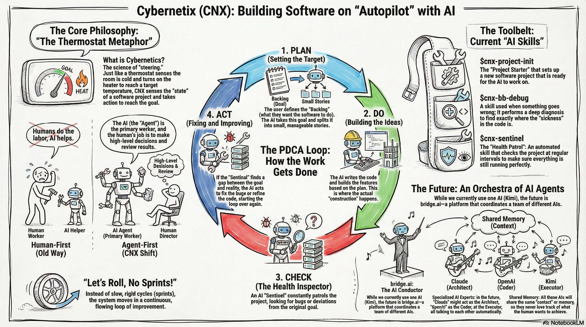
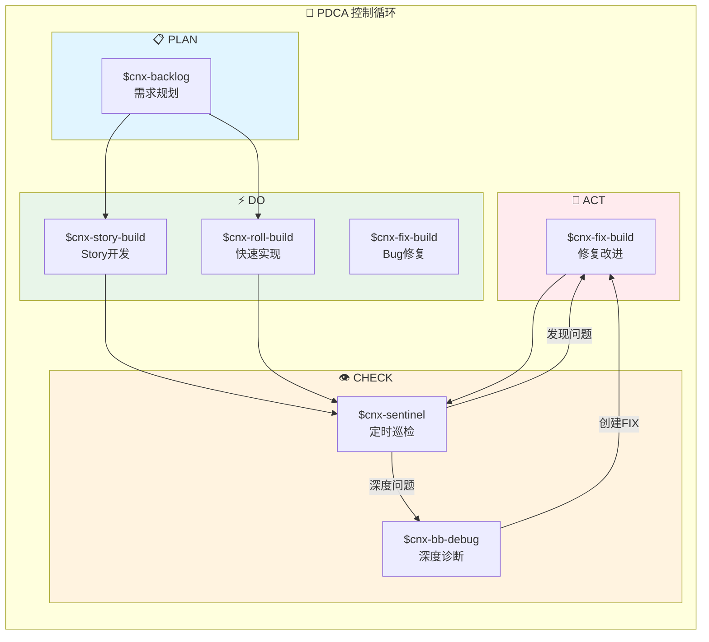

# Cybernetix (CNX)



```
╔═══════════════════════════════════════════════════════════════════════════════════════════╗
║                                                                                           ║
║       ██████╗██╗   ██╗██████╗ ███████╗██████╗ ███╗   ██╗███████╗████████╗██╗██╗  ██╗      ║
║      ██╔════╝╚██╗ ██╔╝██╔══██╗██╔════╝██╔══██╗████╗  ██║██╔════╝╚══██╔══╝██║╚██╗██╔╝      ║
║      ██║      ╚████╔╝ ██████╔╝█████╗  ██████╔╝██╔██╗ ██║█████╗     ██║   ██║ ╚███╔╝       ║
║      ██║       ╚██╔╝  ██╔══██╗██╔══╝  ██╔══██╗██║╚██╗██║██╔══╝     ██║   ██║ ██╔██╗       ║
║      ╚██████╗   ██║   ██████╔╝███████╗██║  ██║██║ ╚████║███████╗   ██║   ██║██╔╝ ██╗      ║
║       ╚═════╝   ╚═╝   ╚═════╝ ╚══════╝╚═╝  ╚═╝╚═╝  ╚═══╝╚══════╝   ╚═╝   ╚═╝╚═╝  ╚═╝      ║
║                                                                                           ║
║                         Control Theory × Agent-First                                      ║
║                         Let's roll, no sprints!                                           ║
╚═══════════════════════════════════════════════════════════════════════════════════════════╝
```

> 基于控制论的 Agent-First 软件工程范式
> 
> **C**yber**n**eti**x** - The AI-Native Development Paradigm  
> _Let's roll, no sprints!_

[](LICENSE)

---

## 什么是 Cybernetix？

**Cybernetix (CNX)** 是一套完整的 AI 时代软件开发范式，基于**控制论**（Cybernetics）理论，实现**Agent-First** 的 PDCA 持续改进循环。

### 核心公式

```
控制论 + Agent First + PDCA = AI 时代软件工程
```

### 解决的问题

传统软件开发：
- ❌ 需求理解偏差
- ❌ 人工重复劳动
- ❌ 测试覆盖不足
- ❌ 问题发现滞后

AI Development Paradigm：
- ✅ Agent 理解需求，人类做决策
- ✅ Agent 自动化执行，人类审阅结果
- ✅ Agent 持续验证，数据驱动改进
- ✅ PDCA 闭环，自我优化

---

## 核心理念

### 1. Agent First

**Agent 是第一用户，人类是决策者。**

```
Human: 设定目标、做决策
   ↓
Agent: 理解、执行、验证、优化
   ↓
System: 自我感知、自我改进
```

### 2. PDCA 循环

```
┌─────────┐    ┌─────────┐    ┌─────────┐    ┌─────────┐
│  PLAN   │───→│   DO    │───→│  CHECK  │───→│   ACT   │
│ $cnx- │    │$cnx- │    │$cnx- │    │$cnx- │
│ backlog │    │ story  │    │sentinel │    │ fix   │
│         │    │ -build │    │ patrol │    │ -build │
└─────────┘    └─────────┘    └─────────┘    └─────────┘
     ↑                                              │
     └──────────────────────────────────────────────┘
                 持续改进循环
```

### 3. 控制论基础

基于 Norbert Wiener 的控制论：
- **目标（Goal）**：BACKLOG.md 定义的期望状态
- **感知（Sense）**：Sentinel 定时巡检监控实际状态
- **比较（Compare）**：分析目标与实际的差距
- **行动（Act）**：开发/修复以缩小差距
- **反馈（Feedback）**：验证行动结果

---

## 架构全景



---

## Skill 生态系统

| Skill | PDCA | 功能 | 状态 |
|-------|------|------|------|
| `$cnx-project-init` | - | 初始化 PDCA-ready 项目 | ✅ |
| `$cnx-backlog` | PLAN | 需求规划，拆分 Stories | ✅ |
| `$cnx-story-build` | DO | Story 开发（TCR→CI/CD） | ✅ |
| `$cnx-fix-build` | DO/ACT | Bug 修复 | ✅ |
| `$cnx-roll-build` | PLAN+DO | 一句话快速实现 | ✅ |
| `$cnx-sentinel` | CHECK | 定时巡检/回归测试 | ✅ |
| `$cnx-bb-debug` | CHECK | 深度诊断 | ✅ |
| `$cnx-bb-analyzer` | CHECK | 诊断分析 | ✅ |
| `$cnx-qa-cover` | Support | 测试规范 | ✅ |

---

## Tools 工具集

CNX Tools 提供编程范式之外的**环境协同能力**：

| Tool | 类型 | 功能 | 状态 |
|------|------|------|------|
| `$cnx-scout` | 🕵️ 情报 | 网页抓取、搜索、爬取，支持产品调研和技术方案搜索 | ✅ |
| `$cnx-sentry` | 🔭 监控 | 节点发现、健康检查、环境诊断 | ✅ |

### Scout + Sentry 组合

```
Scout (侦察兵)      Sentry (哨兵)
    🕵️                 🔭
情报收集            环境监控
- 产品调研          - 节点发现
- 竞品分析          - 健康检查
- 技术方案          - 故障诊断
```

---

## 快速开始

### 安装

```bash
# 克隆项目
git clone https://github.com/seanyao/cybernetix.git

# 安装 Skill（未来：npm install -g cybernetix）
# 当前：手动配置 .codex/skills 软连接
```

### 使用

```bash
# 1. 初始化项目
$cnx-project-init my-app
cd my-app

# 2. PLAN - 规划需求
$cnx-backlog "用户登录功能"
# → 创建 docs/plans/2024-01-20-auth/design.md
# → BACKLOG.md 新增 US-001

# 3. DO - 开发实现
$cnx-story-build US-001
# → TCR 开发 → CI/CD → Deploy
# → BACKLOG.md: US-001 ✅

# 4. CHECK - 自动巡检（GitHub Actions）
# Sentinel 每6小时自动运行
# → 发现问题 → 创建 FIX-001

# 5. ACT - 修复改进
$cnx-fix-build FIX-001
# → TCR 修复 → Deploy → Sentinel 验证 ✅
```

---

## 项目结构

```
my-project/
├── 📋 BACKLOG.md              # PDCA 核心工作区
├── 🤖 AGENTS.md               # 架构约束 & Skill 路由
├── 📁 docs/plans/             # Plan 阶段产出
├── 📦 src/domains/            # DDD 领域代码
├── 🔌 api/                    # API 层
├── 🖥️ cli/                    # CLI 工具
├── 📋 schema/                 # 数据契约
├── 🧪 tests/                  # 测试
└── ⚙️ .github/workflows/      # CI/CD + Sentinel
```

---

## 架构原则

| 原则 | 说明 |
|------|------|
| **Agent First** | 系统为 AI Agent 设计 |
| **Data Schema** | 清晰的数据契约 |
| **Domain Driven** | 业务领域建模 |
| **API/CLI** | 能力完全开放 |
| **Stateless** | 无状态可扩展 |

---

## 文档

- [PARADIGM.md](./PARADIGM.md) - 完整范式文档（控制论、PDCA、多智能体）
- [template/README.md](./template/README.md) - 项目模板说明

---

## 当前状态 & 未来方向

### 当前（已实践）✅

- 单一 Agent（Kimi Code CLI）+ Skill 生态系统
- PDCA 闭环完整可运行
- 10+ Skills 已开发
- 项目模板已验证

### 未来（理论+载体）🔮

- 多智能体协同（Claude/Codex/Kimi/...）
- **bridge.ai** 作为协同平台
- 自动编排，降低人工决策

---

## 贡献

欢迎贡献新的 Skills 和改进建议！

---

## License

MIT License - 详见 [LICENSE](./LICENSE)
