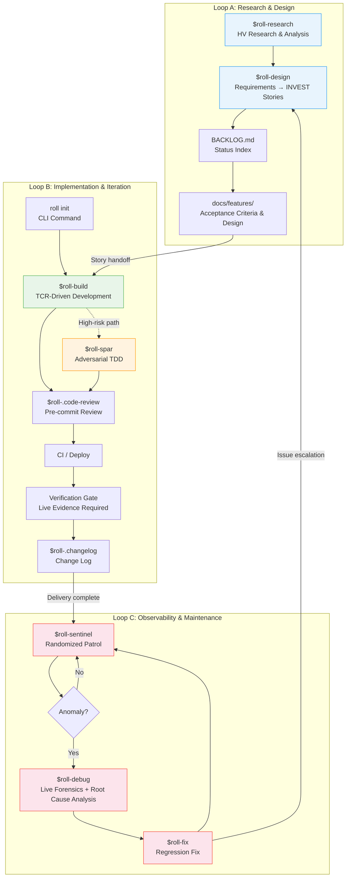
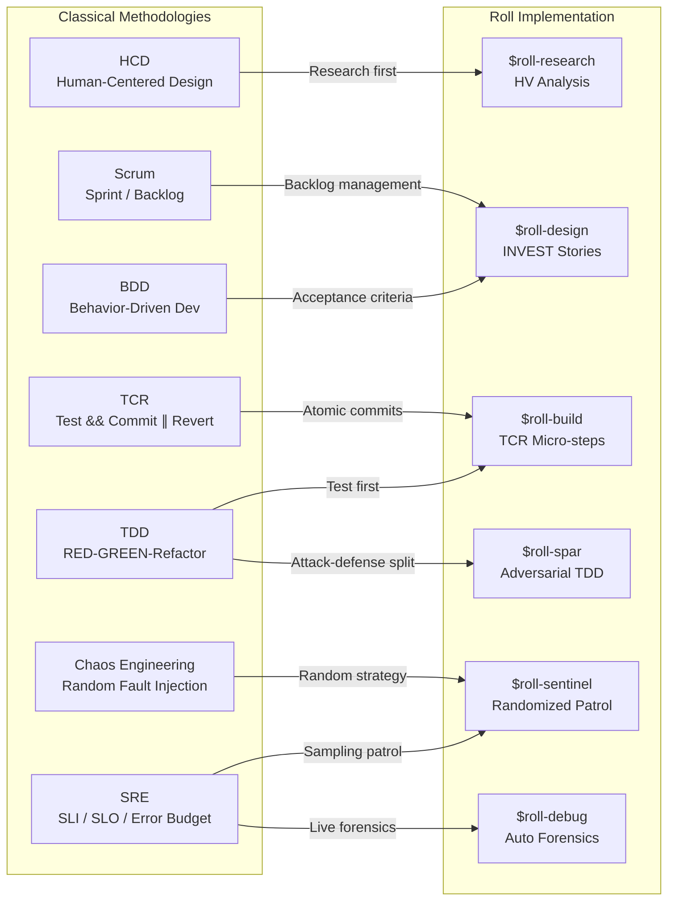

# Roll Engineering Methodology: A Standardized AI Agent Delivery Framework

> **Version:** 1.0
> **Date:** 2026-04-15
> **Status:** Internal Engineering Whitepaper

---

## Abstract

As AI coding assistants evolve from point tools into team infrastructure, engineering organizations face an underappreciated challenge: **inconsistent behavior across AI clients (Claude Code, Gemini CLI, Cursor, Codex), fragmented environment configuration, and the absence of auditable quality gates on deliverables**. One developer writes code with Claude that passes local tests; another uses Cursor and bypasses those same tests — not because of a capability gap between the models, but because the two received entirely different engineering constraints.

Roll is an **instruction and workflow management framework for AI Agents**. It does not invent new methodology. Instead, it encodes proven software engineering practices (Scrum, TDD, TCR, SRE) as standardized, AI-executable Skill definitions, and enforces cross-client configuration consistency through a CLI tool.

This document describes Roll's three-loop engineering architecture and its corresponding technical implementation.

The name is the design philosophy: Roll (悟空), the shape-shifting trickster, gains discipline from the golden headband (_金箍_) without losing any of his power. Roll the framework takes the same position — AI Agent capability is not diminished by constraint. Standardized constraints are precisely what make that capability composable and transferable at team scale.

---

## 1. Architecture Overview: Three Interlocking Loops

Roll decomposes the software delivery lifecycle into three loops, each independently operable yet mutually reinforcing. Every loop inherits a set of classical methodologies and automates their execution through concrete Skills.



How the three loops interact:

- **Loop A → Loop B**: User Stories produced by the design loop flow into the implementation loop as execution units.
- **Loop B → Loop C**: Each deployment automatically brings new deliverables under the patrol loop's monitoring scope.
- **Loop C → Loop A**: Issues found during patrol that exceed the scope of a quick fix escalate back to the design loop for reassessment.

---

## 2. Global Configuration Management (Configuration Infrastructure)

### 2.1 The Problem

In environments where multiple AI clients coexist, each client has its own configuration entry point (Claude reads `CLAUDE.md`, Gemini reads `GEMINI.md`, Cursor reads `.cursor-rules`). Maintaining these files manually leads to:

- **Behavioral drift**: Different AI clients on the same project enforce different coding standards.
- **Fragmented configuration**: Engineering constraints scattered across multiple locations, with updates prone to gaps.
- **Cross-project inconsistency**: New projects cannot inherit the organization's engineering standards.

### 2.2 Technical Implementation

Roll uses the `roll` CLI to centralize configuration management and distribute it atomically.

**2.2.1 Skill Mounting (`roll setup`)**

On first run, the CLI performs two operations:

1. **Establish a Single Source of Truth**: Copies global conventions (`conventions/global/`) and skill definitions (`skills/`) from the repository into `~/.roll/`, making it the sole authoritative configuration source on the machine.
2. **Per-skill symlinks**: Creates individual symlinks for each `roll-*` skill into each AI client's skills directory (`~/.claude/skills/roll-*`, `~/.gemini/skills/roll-*`, etc.). Existing user skills are untouched — Roll skills are added alongside.

Setup never modifies any AI tool configuration files or global git settings. It is fully non-invasive and safe to re-run.

**2.2.2 Configuration Sync (`roll sync [scope]`)**

Distributes content from `~/.roll/` to each AI client's configuration path based on the selected scope.

- `conventions` (default): uses `@include` append mode — writes WK conventions to `{ai_dir}/wk.md`, then appends a single `@wk.md` line to the user's main config. Existing content is never overwritten.
- `skills`: refreshes skills from the repo into the local cache and creates/repairs per-skill symlinks for each client
- `all`: runs both conventions and skills

Append `--force` (or `-f`) to force-rewrite `wk.md` or rebuild symlinks.

```
~/.roll/conventions/global/
├── AGENTS.md        → ~/.kimi/wk.md (+ @wk.md appended to AGENTS.md)
├── CLAUDE.md        → ~/.claude/wk.md (+ @wk.md appended to CLAUDE.md)
├── GEMINI.md        → ~/.gemini/wk.md (+ @wk.md appended to GEMINI.md)
└── .cursor-rules    → (project-level distribution)
```

**Git Hook (optional — `roll hook install`)**

Installs a global `prepare-commit-msg` hook that automatically detects which AI client authored the current commit and stamps it (e.g., `[claude code]`, `[gemini cli]`), enabling audit tracing in multi-agent workflows. This is an opt-in operation that modifies global git configuration — it shows the current state and requires explicit confirmation before proceeding.

**2.2.3 Project-Level Configuration (`roll init`)**

`roll init` creates three workflow files in the current directory — instantly, with no prompts:

- `AGENTS.md` — global engineering constraints (copied from `~/.roll/conventions/global/`)
- `BACKLOG.md` — empty task index
- `docs/features/` — directory for story details and design documents

For **existing projects** (AGENTS.md already present), `roll init` re-merges the global conventions section-by-section, preserving all existing project-specific content.

Project-type templates (`conventions/templates/`) still exist as **reference material for skills** — `$roll-build` and `$roll-design` read them to infer conventions for a given project type. Users no longer select a type at init time.

### 2.3 Configuration Hierarchy

```
Organization (Global)    ← Coding standards, Git discipline, TCR workflow, test standards
  ↓ roll init (direct copy, no type selection)
Project Instance         ← AGENTS.md (constraints) + .claude/CLAUDE.md (client config)
  (skills infer type from existing files)
Project Type (Template)  ← Reference only — consulted by $roll-build / $roll-design at runtime
```

---

## 3. Loop A: Product Definition and Requirements Design

### 3.1 Methodology Inheritance

| Classical Methodology | Roll Implementation |
|----------------------|--------------------|
| HCD (Human-Centered Design) | `$roll-research`: Research before design; data-driven decision-making |
| BDD (Behavior-Driven Development) | `$roll-design`: Requirements expressed as Acceptance Criteria |
| Scrum Backlog | `BACKLOG.md` + `docs/features/`: Two-tier index structure |
| INVEST Principles | Mandatory constraints on Story decomposition |

### 3.2 Research-Driven Design: `$roll-research`

Structured research precedes requirements definition, preventing design decisions made on gut instinct alone. `$roll-research` implements **HV Analysis (Horizontal-Vertical Analysis)**:

- **Vertical Axis**: Traces the full evolutionary arc of the subject — from its origins to the present — along a timeline. Produces a narrative analysis of 6,000–15,000 words, covering key inflection points, technology iterations, and market shifts.
- **Horizontal Axis**: Performs systematic benchmarking against comparable products and solutions at the current point in time. Produces a comparative analysis of 3,000–10,000 words, covering feature matrices, technology approaches, and positioning differences.
- **Cross-Axis Insights**: Cross-validates findings from both axes to surface trend predictions and strategic recommendations.

Research follows a strict source priority hierarchy: **primary sources > industry reports > secondary analysis**. Fabricating data is prohibited — information that cannot be verified is marked as unavailable, never invented.

The final output is a structured Markdown report that can be converted to a PDF with cover page and table of contents using the built-in `md_to_pdf.py` script (powered by WeasyPrint).

> **Scenario**: TaskFlow plans to add an "organization-level permission management" module. Before writing a single line, `$roll-research` conducts an HV analysis on "B2B SaaS permission models" — the vertical axis traces the ACL → RBAC → ABAC → ReBAC evolution, while the horizontal axis compares how Linear, Notion, and GitHub each implement permissions.
>
> The cross-axis insight: after 2023, mainstream products universally layered resource-level fine-grained controls on top of RBAC — pure RBAC has become the minimum viable bar. This finding directly shaped how `$roll-design` decomposed Stories downstream, averting a rework cycle that would have surfaced only after delivery.

### 3.3 Requirement Atomization: `$roll-design`

Translates research findings and business requirements into instruction contracts that AI can execute. The core output is User Stories that conform to the **INVEST principles**:

| Principle | Requirement |
|-----------|-------------|
| **I**ndependent | Each Story can be delivered independently with no cross-dependencies |
| **N**egotiable | Defines acceptance criteria, not implementation details |
| **V**aluable | Each Story delivers perceptible user value |
| **E**stimable | Implementation scope is assessable; Action granularity is 2–5 minutes |
| **S**mall | A single Story can be completed within one session cycle |
| **T**estable | Each Story includes verifiable acceptance criteria |

> **Scenario**: A product manager's raw requirement is "admins should be able to see everyone's activity logs." `$roll-design` decomposes this into three independent Stories: US-007 (write audit events), US-008 (audit list UI with filtering), and US-009 (export audit data as CSV).
>
> Each Story carries its own acceptance criteria — US-007's AC includes "create/delete/modify operations all generate audit events" and "events include actor ID, timestamp, and change diff." The export capability, which was buried implicitly in the original requirement, is surfaced as an explicit standalone Story rather than hidden in implementation details.

### 3.4 Management Artifacts: Two-Tier Index Structure

**`BACKLOG.md` (status index)** — the project's central state machine. Contains only Story ID, title, and status summary; implementation details are excluded:

```markdown
## Stories
| ID     | Title                | Status |
|--------|----------------------|--------|
| US-001 | User login           | ✅ Done |
| US-002 | Role-based access    | 🔨 In Progress |
| US-003 | Audit logging        | 📋 Ready |
```

**`docs/features/` (detailed design)** — each Story has two dedicated documents:

- `<feature>.md`: Full User Story including the Acceptance Criteria checklist.
- `<feature>-plan.md`: Technical design document with architectural decisions and implementation approach.

This separation keeps BACKLOG.md concise and readable as a progress dashboard, while detailed design lives in a dedicated location.

> **Design principle — Markdown as Code**: In Roll, `BACKLOG.md` and `docs/features/` are not documentation artifacts generated after development — they are the input that drives development. A Story does not exist until it has a Markdown file. A Story is not done until its Verification Gate evidence is committed. The file system is the single source of truth; there is no separate project management tool to stay in sync with.

---

## 4. Loop B: Automated Implementation and Continuous Integration

### 4.1 Methodology Inheritance

| Classical Methodology | Roll Implementation |
|----------------------|--------------------|
| TDD (Test-Driven Development) | Tests written first; RED → GREEN → Refactor |
| TCR (Test && Commit ∥ Revert) | `$roll-build`: commit on pass, revert on failure |
| DevOps / CI-CD | Objective arbitration layer: CI is the final authority on "deliverable"; minute-level feedback loops compress defect discovery cost |
| Defensive Programming | `$roll-spar`: adversarial TDD for high-risk paths |

### 4.2 Project Initialization: `roll init`

Creates the minimal workflow scaffold needed to start a Roll-managed project — no questions asked, no type selection, no directory scaffold.

**What `roll init` creates:**

```
my-project/
├── AGENTS.md            # Engineering constraints (from global conventions)
├── BACKLOG.md           # Task index
└── docs/features/       # Story details & design documents
```

Three files. Under 5 seconds. Then `roll sync` to distribute conventions to AI tool configs.

**Existing project (re-merge):**

When `AGENTS.md` already exists, `roll init` re-merges the global conventions section-by-section — adding any new sections from the global template while preserving all existing project-specific content.

**Project structure is inferred, not declared:**

Directory structure (`src/`, `api/`, `cmd/`, etc.) is created **on demand** by `$roll-build` and `$roll-design` as Stories are executed. Skills read existing project files (`package.json`, `go.mod`, directory layout) to infer conventions — the right structure emerges from evidence, not from an upfront type declaration.

Project-type templates (`conventions/templates/fullstack/`, `cli/`, etc.) remain available as reference material for skills to consult.

### 4.3 TCR-Driven Development: `$roll-build`

This is Roll's core execution unit. Its engineering significance lies in a fundamental shift: **correctness is not determined by the AI's own assertions, but exclusively by the pass/fail status of automated tests**.

**TCR (Test && Commit || Revert) execution flow:**

```
┌─────────────────────────────────────────────────────┐
│                  TCR Micro-Step                      │
├─────────────────────────────────────────────────────┤
│                                                      │
│  1. Write failing test (RED)                         │
│              │                                       │
│              ▼                                       │
│  2. Write minimal code to pass (GREEN)               │
│              │                                       │
│              ▼                                       │
│  3. Run tests ──── FAIL? ──── Revert changes         │
│              │                                       │
│            PASS                                      │
│              │                                       │
│              ▼                                       │
│  4. $roll-.code-review (self-review gate)             │
│              │                                       │
│              ▼                                       │
│  5. git commit (micro-commit)                        │
│              │                                       │
│              └──── Back to Step 1, next Action       │
│                                                      │
└─────────────────────────────────────────────────────┘
```

Each Action is constrained to **2–5 minutes** of scope. The engineering rationale for this constraint:

- **Near-zero rollback cost**: Any failure discards at most a few minutes of work.
- **Errors do not compound**: Failing logic cannot be depended on by subsequent code, preventing hidden debt from accumulating in the codebase.
- **Observable progress**: The micro-commit sequence is itself a real-time record of delivery progress.

**The complete delivery pipeline** — `$roll-build` does not stop at local tests passing. It requires completing the full end-to-end delivery chain:

```
TCR Micro-commits → git push → CI Pass → Deploy → Verification Gate
```

The **Verification Gate** is the final checkpoint: it requires **live evidence** (test output screenshots, curl responses, browser screenshots). The AI's own assertions ("I confirmed it works") are not accepted.

> **Scenario**: Executing US-007 (write audit events).
>
> Action 1: Write a RED test for `AuditService.record()` asserting that task creation triggers an audit write → implement minimal code → GREEN → code-review passes → `tcr: audit event on task create`.
>
> Action 2: Write a RED test for delete operations → discover `TaskService.delete()` is missing a hook injection point → add the implementation → GREEN → commit.
>
> 4 micro-commits total, zero manual intervention throughout. CI triggers all GREEN, auto-deploys to staging. Verification Gate collects evidence: `curl /api/audit` returns the correct event list, screenshot archived, US-007 closed.

### 4.4 Continuous Integration / Continuous Delivery: The Fast Feedback Infrastructure

CI/CD is not an "add-on" to Roll — it is the **objective arbitration layer** for all of Loop B. Passing tests locally is a necessary condition, not a sufficient one. Local environments carry implicit dependencies, uncommitted state, and machine-specific configuration. CI re-executes the same code in a clean, deterministic environment, making it the final authority on whether something is truly deliverable.

**4.4.1 CI as Objective Arbiter**

TCR promises "commit on passing tests," but that promise only holds once it is validated at the CI layer:

```
Local GREEN ≠ Deliverable
CI GREEN    = Deliverable
```

CI's scope extends beyond running the test suite — it is a complete quality gate sequence:

| Check | Purpose |
|-------|---------|
| **Lint / Type Check** | Coding standards and type safety; prevents low-grade errors from reaching the main branch |
| **Unit & Integration Tests** | Regression assurance for business logic; corroborates local TCR results |
| **Coverage Gate** | Enforces coverage thresholds; prevents test debt accumulation |
| **Build Artifact** | Confirms the build artifact can be generated; rules out dependency resolution issues |
| **E2E Smoke** | Smoke validation of critical paths in a real environment |

If any check fails, the deployment pipeline halts automatically. There is no "deploy first, fix tests later" path.

**4.4.2 The Engineering Value of Fast Feedback Loops**

The later a defect is discovered, the more expensive it is to fix — this is not folk wisdom, it is an empirically supported engineering finding. A bug caught within 5 minutes of commit costs roughly the same as initial development to fix. Caught in a test environment, the cost multiplies by 10. Caught in production, by 100.

Roll's TCR + CI combination compresses the feedback window to **minutes**:

```
micro-commit (2–5 min granularity)
    → git push (immediate)
        → CI triggered (seconds)
            → result returned (minutes)
                → problem localized (to this exact commit)
```

The micro-step granularity constraint (2–5 min/Action) delivers a second benefit here: when CI fails, the amount of code to triage is minimal, and the root cause is almost always immediately obvious.

**4.4.3 Two Independent Workflow Pipelines**

A Roll project's CI configuration typically contains two independent pipelines corresponding to different trigger scenarios:

```
.github/workflows/
├── ci.yml          # Triggered on every push / PR
│                   # Runs the complete quality gate sequence
│                   # GREEN → unlocks CD deployment permission
│
└── sentinel.yml    # Triggered by cron schedule (unattended)
                    # Runs $roll-sentinel patrol tasks
                    # Provides the observability infrastructure for Loop C
```

`sentinel.yml` is a foundational dependency for Loop C — Loop C's continuous patrol capability runs on top of the CI platform, illustrating the infrastructure-level unity across all three loops.

**4.4.4 The CD and Verification Gate Dependency Chain**

The Verification Gate (live evidence acceptance) sits at the very end of Loop B, and its existence depends on a successful CD deployment:

```
CI PASS
  → CD: deploy to target environment
      → Verification Gate: collect evidence from the deployed version
          → screenshots / curl responses / test output
              → Story closed
```

Without CD there is no verifiable target, rendering the Verification Gate meaningless. This dependency chain ensures that **Story closure evidence must come from the live production environment, not a local simulation**.

---

### 4.5 Adversarial TDD: `$roll-spar`

For high-risk paths — authorization, payments, data integrity — standard TDD coverage is insufficient. Tests and implementation are written by the same Agent, creating cognitive blind spots. `$roll-spar` introduces an adversarial mechanism:

| Role | Responsibility | Constraint |
|------|---------------|------------|
| **Attacker** | Writes test cases designed to break the system | May not write any implementation code |
| **Defender** | Writes the minimal code to make tests pass | May not modify the Attacker's tests |

The adversarial cycle continues until the Attacker cannot produce a new RED test for two consecutive rounds, or all predefined scenarios are covered (maximum 5 rounds). Each round's results are committed independently, keeping the adversarial process fully traceable.

Automatic trigger signals: when a Story touches authentication/authorization, payment/billing, data integrity validation, complex state machines, or historically high-defect modules, `$roll-build` automatically routes the Action to `$roll-spar`.

> **Scenario**: US-010 (organization member permission changes) triggers the `$roll-spar` auto-route.
>
> The Attacker's first round produces 3 RED tests: a regular member escalating privileges to modify another's role, whether an admin can continue operating after demoting themselves, and concurrent requests simultaneously modifying the same user's role. After the Defender implements passing code for all three, the Attacker's second round adds: if a role change succeeds at the DB level but the notification fails, does the permission atomically roll back?
>
> On round three, the Attacker cannot produce any new RED tests — the adversarial session ends. Test coverage on the permission module rises from the typical TDD baseline of 71% to 93%.

### 4.6 Delivery Traceability

After each successful deployment, two mechanisms ensure deliverables remain traceable:

- **`$roll-.changelog`**: Automatically extracts completed Stories from BACKLOG.md, filters out internal technical details, and generates a user-facing changelog.
- **Git Hook (AI source tagging)**: The global `prepare-commit-msg` hook auto-detects the active AI client (via environment variables `CLAUDE_CODE`, `GEMINI_CLI`, `KIMI_CODE`, etc.) and injects a source tag into the commit message (e.g., `[claude code]`, `[gemini cli]`). In multi-Agent workflows, `git log` shows the actual executor of every commit at a glance.

---

## 5. Loop C: Observability and Resilience Maintenance

### 5.1 Methodology Inheritance

| Classical Methodology | Roll Implementation |
|----------------------|--------------------|
| SRE (Site Reliability Engineering) | `$roll-sentinel`: Sampling-based automated patrol |
| Chaos Engineering | Randomized patrol strategy simulating unpredictable check patterns |
| Digital Forensics + RCA | `$roll-debug`: Automated on-scene evidence collection and root cause analysis |

### 5.2 Randomized Patrol: `$roll-sentinel`

`$roll-sentinel` provides continuous health monitoring for delivered features. Its core design philosophy is **probabilistic sampling over exhaustive regression**, striking a balance between cost and coverage.

**Patrol strategy matrix:**

| Strategy | Sampling Rate | When to Use |
|----------|--------------|-------------|
| Light | 5 times/day | Day-to-day monitoring during stable periods |
| Normal | 10 times/6 hours | Routine iteration cycles |
| Intensive | 20 times/hour | Post-major-release monitoring |
| Full | Full suite/week | Periodic comprehensive regression |

**Uncertainty handling** — avoiding false positives: a single failure does not trigger an alert; three consecutive failures are required to flag an anomaly.

**Hot-spot detection** — adaptive weighting: Stories that fail repeatedly automatically receive increased sampling weight. Issues discovered by patrol automatically create `FIX-XXX` Backlog entries for `$roll-fix` to handle.

Patrol runs via GitHub Actions `cron` scheduling, providing unattended continuous monitoring.

> **Scenario**: Following the TaskFlow v1.3 release, `$roll-sentinel` runs on the Intensive strategy. On the second sample, the patrol case for US-007 (audit write) fails — audit events exist but the `timestamp` field is empty. A single failure does not trigger an alert.
>
> On the fourth sample, the same case fails for the third consecutive time, crossing the threshold. `FIX-012: audit event timestamp is null` is automatically created and written to the Backlog, and US-007's sampling weight is automatically promoted to the next tier.

### 5.3 Automated Forensics and Root Cause Diagnosis: `$roll-debug`

A Playwright-based end-to-end debugger supporting two operating modes:

- **Native mode**: The target page has integrated the Black Box (BB) SDK; diagnostic data is collected directly via the SDK interface.
- **Universal mode**: No integration required on the target page; Playwright injects a collection script, enabling forensics on any web page.

Data dimensions collected automatically:

| Dimension | Collected Data |
|-----------|---------------|
| Console | Error logs, warnings, uncaught exceptions |
| Network | Request/response payloads, failed requests, slow requests |
| DOM | Page structure, render state, presence of critical elements |
| Performance | Load times, resource timing, interaction latency |
| Screenshot | Visual snapshot of the current page state |

After collection, `$roll-debug` performs structured multi-dimensional analysis (content state, network failures, DOM rendering anomalies, performance bottlenecks), outputting diagnostic conclusions and remediation recommendations.

> **Scenario (cont.)**: `$roll-debug` runs forensics on the audit list page. The Network dimension captures `GET /api/audit` returning 200 but with `timestamp` as `null`; the Console dimension simultaneously shows `[warn] AuditEvent serializer: missing timestamp`.
>
> `$roll-debug` consumes the diagnostic JSON and isolates the root cause: the v1.3 ORM upgrade introduced a field alias change that was not reflected in the serialization layer, breaking the `created_at` → `timestamp` mapping. The fix direction is clear; handed off to `$roll-fix`.

### 5.4 Regression Repair: `$roll-fix`

Executes a fix for a single issue — lighter-weight than `$roll-build`, but held to the same quality standards:

- **Mandatory regression tests**: Every fix patch must include a regression test case targeting the specific issue, preventing recurrence.
- **Scope constraint**: One Fix handles one issue. If the fix reveals a scope wider than expected, it escalates to a User Story and re-enters Loop A.
- **Same quality gates**: Verification Gate, CI Pass, and production verification all apply equally.

> **Scenario (cont.)**: `$roll-fix` executes FIX-012, with scope strictly limited to the serialization layer field mapping. A regression test is added (asserting `timestamp` is non-null and conforms to ISO 8601 format).
>
> 1 commit, CI GREEN, post-deployment Verification Gate confirms the audit list timestamps have recovered, FIX-012 closed. On the next `$roll-sentinel` sample cycle, the check passes and US-007's sampling weight returns to baseline.

---

## 6. Engineering Baseline: Engineering Common Sense

Roll defines 9 non-negotiable engineering baselines that apply across all three loops. These are not "best practice suggestions" — they are mandatory checks in the Test Design Review phase of every Story:

| # | Baseline | Definition | Anti-Pattern |
|---|----------|-----------|--------------|
| 1 | **Idempotency** | Executing the same operation N times yields the same result as executing it once | "This won't be called twice anyway" |
| 2 | **Cross-Module Contracts** | Shared IDs, formats, and algorithms are consistent across all modules | "The other side will handle the format conversion" |
| 3 | **Data Flow Integrity** | Producer → storage → consumer validated end-to-end | "As long as it's in the database it's fine" |
| 4 | **Atomicity** | On partial failure, perform a complete rollback — leave no intermediate state | "The failure probability is very low" |
| 5 | **Input Validation** | All external inputs (API, user, file) are validated at the boundary | "Internal calls don't need validation" |
| 6 | **Graceful Degradation** | When a dependency fails, degrade service rather than crash | "That service won't go down" |
| 7 | **Observability** | Progress, state, and errors are visible to the user | "It can be looked up in the logs" |
| 8 | **Concurrency Safety** | Shared resource access is safe under multi-thread / multi-process conditions | "We only have a single instance right now" |
| 9 | **Infer First, Confirm Intent** | Never ask the user for facts the machine can deduce; only ask the user to decide intent (keep / switch / merge) | "Just let the user pick — safer that way" |

**Baseline 9 expanded:** Before prompting the user, any tool must exhaust available context (files, config, environment). Present the inferred result as "confirm or override" — never ask users to fill in information from scratch when the system already has signals. Two modes:
- **new-scratch** (no context whatsoever): a selection menu is the correct prompt
- **legacy-auto** (code, config, or metadata exists): scan → infer → ask only "keep [Y] or switch [1-4]?"

The full menu is a fallback, not the default entry point. An `--auto` / `auto` argument is reserved for non-interactive CI/script use.

---

## 7. Passive Support Skills

Beyond the active Skills in the three loops, Roll includes a set of passively triggered support skills:

| Skill | Trigger | Purpose |
|-------|---------|---------|
| `$roll-.echo` | When user input is ambiguous or contradictory | Restates intent and resolves ambiguity before proceeding, avoiding wasted compute on a misunderstood instruction |
| `$roll-.code-review` | After each TCR micro-step completes | Multi-dimensional self-review (security, maintainability, performance, scope); a Critical finding blocks the commit |
| `$roll-.qa-cover` | During the Test Design Review phase | Defines the test pyramid (Unit > E2E > Visual > Smoke) and enforces coverage thresholds |
| `$roll-.changelog` | After a successful deployment | Extracts completed items from BACKLOG and generates a user-readable changelog |

---

## 8. Relationship to Classical Methodologies

Roll is not a new methodology. It encodes proven engineering practices as standardized instructions that AI Agents can understand and execute.



The key distinction lies in the shift of execution subject: these methodologies originally depended on engineers' personal discipline (humans tire, humans cut corners). Roll hardens them into instruction constraints for AI Agents — an Agent will never "skip the tests just this once," because that branch does not exist in the Skill definition.

---

## 9. Limitations and Current State

**Validated:**

- Feedback-driven continuous delivery loop (Design → Build → Check → Fix)
- A standardized skill set of 14 Skills + 2 Tools
- Cross-AI-client configuration consistency management (`roll` CLI)
- TCR micro-commits + Verification Gate quality assurance mechanism
- Multi-Agent audit tracing via Git Hooks

**Current Limitations:**

- **Multi-Agent coordination overhead**: `$roll-build` evaluates Action dependencies to determine whether to launch parallel sub-Agents, but cross-Agent state synchronization and conflict resolution currently depend on conventions rather than enforced protocols, incurring coordination overhead in high-concurrency scenarios.
- **Framework coupling**: Skill definitions are written in Markdown and rely on AI clients' ability to interpret natural language instructions — execution precision varies across different models.
- **Patrol coverage**: `$roll-sentinel`'s sampling strategy effectively controls cost, but it does not provide the same coverage guarantee as exhaustive regression testing.

---

## Appendix A: Skill Quick Reference

| Skill | Phase | Input | Output |
|-------|-------|-------|--------|
| `$roll-research` | Research | Research topic | Markdown / PDF research report |
| `$roll-design` | Design | Requirements description | BACKLOG.md + docs/features/ |
| `$roll-build` | Implementation | Story ID / one-sentence requirement | Deployed code + verification evidence |
| `$roll-spar` | Defensive implementation | Feature description | Adversarial test suite + implementation code |
| `$roll-fix` | Bug fix | Fix ID | Fix code + regression test |
| `$roll-sentinel` | Patrol | Patrol strategy | Health report / FIX entries |
| `$roll-debug` | Debugging & Diagnosis | URL / Diagnostic JSON | Root cause analysis + remediation recommendations |

## Appendix B: CLI Command Quick Reference

| Command | Purpose |
|---------|---------|
| `roll setup` | Install ~/.roll/ + sync conventions and skills to AI tools in one step |
| `roll sync` | Sync conventions to AI tool configs + refresh skill symlinks |
| `roll hook install` | Opt-in: install global git hook (requires confirmation) |
| `roll init` | Create AGENTS.md + BACKLOG.md + docs/features/ in cwd (no prompts); re-merges if AGENTS.md exists |
| `roll reset` | Reset `~/.roll/` from the repository source, then sync |
| `roll status` | Display current configuration state, sync status, and skill links |
