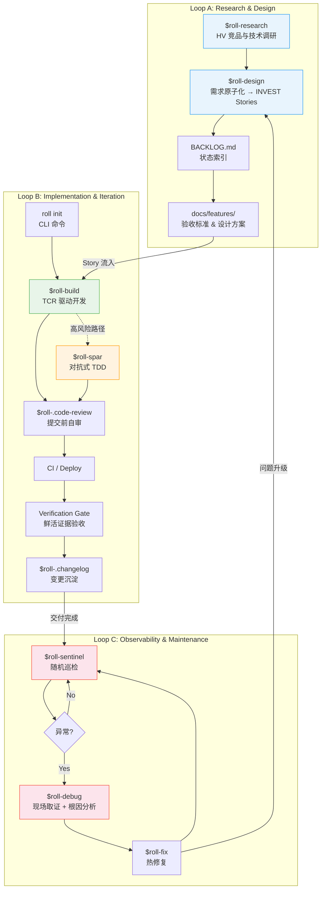
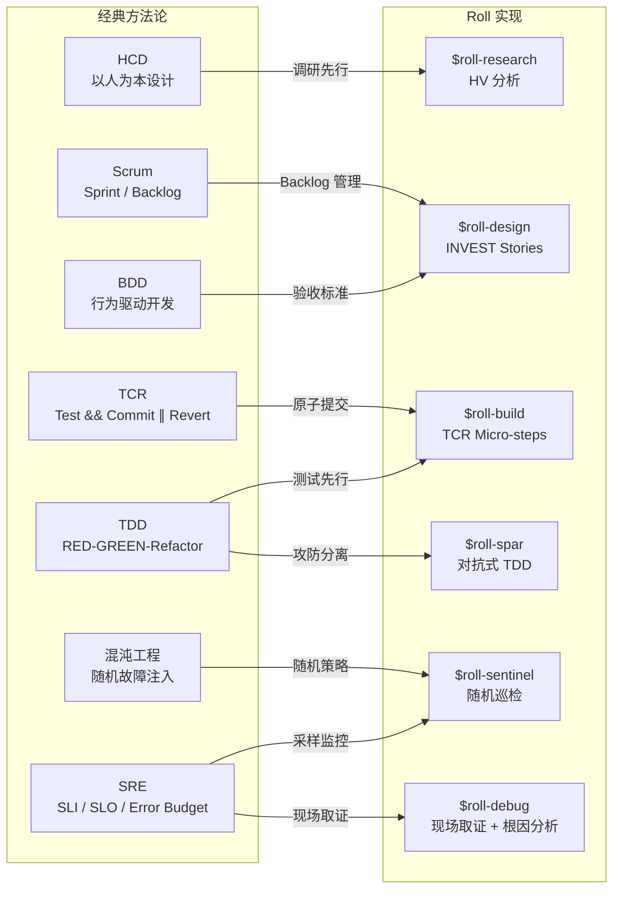

# Roll 工程方法论：基于 AI Agent 的标准化交付流

> **Version:** 1.0  
> **Date:** 2026-04-15  
> **Status:** Internal Engineering Whitepaper
---

## 摘要

当 AI 编程助手从单点工具进化为团队基础设施时，工程组织面临一个被低估的问题：**不同 AI 客户端（Claude Code, Gemini CLI, Cursor, Codex）的行为标准不一致、环境配置碎片化、交付物缺乏可审计的质量门禁**。一个开发者用 Claude 写的代码通过了本地测试，另一个用 Cursor 写的代码绕过了同一测试——不是因为 AI 能力差异，而是因为它们接收到的工程约束完全不同。

Roll 是一个面向 AI Agent 的**指令与工作流管理框架**。它不发明新的方法论，而是将经典软件工程实践（Scrum、TDD、TCR、SRE）编码为 AI 可执行的标准化技能集（Skills），并通过 CLI 工具实现跨客户端的配置一致性。

本文档描述 Roll 的三层工程闭环架构及其对应的技术实现。

命名即设计哲学：悟空拥有无限变化的能力，金箍赋予他约束与纪律，而能力本身分毫不减。Roll 框架的核心主张正在于此——AI Agent 的能力不因约束而削弱，恰恰相反，标准化的约束让这种能力在团队规模下可组合、可传递、可审计。

---

## 1. 架构总览：三层工程闭环

Roll 将软件交付生命周期分解为三个可独立运转、又彼此反馈的闭环。每个闭环继承一组经典方法论，并通过具体的 Skill 实现自动化执行。



三个闭环的协同关系：

- **Loop A → Loop B**：设计闭环产出的 User Story 流入实现闭环作为执行单元。
- **Loop B → Loop C**：每次部署完成后，巡检闭环自动纳入新交付物进行监控。
- **Loop C → Loop A**：巡检发现的问题若超出修复范围，升级回设计闭环重新评估。

---

## 2. 全局配置管理 (Configuration Infrastructure)

### 2.1 解决的问题

在多 AI 客户端并存的开发环境中，每个客户端有独立的配置入口（Claude 读 `CLAUDE.md`，Gemini 读 `GEMINI.md`，Cursor 读 `.cursor-rules`）。手动维护这些文件会导致：

- **行为漂移**：同一项目中不同 AI 客户端执行不同的代码规范。
- **配置碎片化**：工程约束散落在多个位置，更新时容易遗漏。
- **项目间不一致**：新项目无法继承组织级的工程标准。

### 2.2 技术实现

Roll 通过 `roll` CLI 工具实现配置的集中管理与原子化分发。

**2.2.1 指令集挂载 (`roll setup`)**

首次执行时，CLI 完成两项工作：

1. **建立 Single Source of Truth**：将仓库中的全局约定（`conventions/global/`）和技能定义（`skills/`）复制到 `~/.roll/`，作为本机唯一的配置源。
2. **按 skill 逐个软链**：为 `~/.roll/skills/` 中每个 `roll-*` 技能单独创建符号链接，挂载到各 AI 客户端目录（`~/.claude/skills/roll-*`、`~/.gemini/skills/roll-*` 等）。用户已有的 skills 不受影响，Roll skills 独立并存。

setup 不修改任何 AI 工具的配置文件，也不改变全局 git 配置，保证零侵入。

**2.2.2 配置同步 (`roll sync [-f]`)**

将 `~/.roll/` 中的约定与技能一步分发到各 AI 客户端配置路径。

- **约定**：以 `@include` 追加模式分发 — 将 Roll 约定写入 `{ai_dir}/wk.md`，并在用户主配置末尾追加一行 `@wk.md`，原有内容永远不被覆盖。
- **技能**：从仓库刷新 skills 到本地缓存，并创建/修复各客户端的 per-skill symlink。

加上 `--force`（或 `-f`）可强制重写 `wk.md` 或重建 symlink。

```
~/.roll/conventions/global/
├── AGENTS.md        → ~/.kimi/wk.md (+ @wk.md appended to AGENTS.md)
├── CLAUDE.md        → ~/.claude/wk.md (+ @wk.md appended to CLAUDE.md)
├── GEMINI.md        → ~/.gemini/wk.md (+ @wk.md appended to GEMINI.md)
└── .cursor-rules    → (项目级分发)
```

**Git Hook（可选，`roll hook install`）**

安装全局 `prepare-commit-msg` 钩子，自动检测当前提交的 AI 客户端来源并标记（如 `[claude code]`、`[gemini cli]`）。这是侵入性操作（修改全局 git 配置），需用户显式执行，安装前会展示当前配置并要求确认。

**2.2.3 项目级配置 (`roll init`)**

`roll init` 在当前目录创建三个工作流文件——即时完成，无任何交互提示：

- `AGENTS.md` — 全局工程约束（从 `~/.roll/conventions/global/` 复制）
- `BACKLOG.md` — 空任务索引
- `docs/features/` — Story 详情与设计文档目录

对于**已有项目**（AGENTS.md 已存在），`roll init` 按节（section）重新合并全局约定，保留所有已有的项目特定内容。

项目类型模板（`conventions/templates/`）作为 **skills 的参考资料**继续存在——`$roll-build` 和 `$roll-design` 读取它们来推断对应项目类型的约定。用户不再需要在 init 时声明类型。

### 2.3 配置层次结构

```
组织级 (Global)    ← 代码规范、Git 纪律、TCR 流程、测试标准
  ↓ roll init（直接注入，无类型选择）
项目实例 (Project)  ← AGENTS.md（约束）+ .claude/CLAUDE.md（客户端配置）
  （skills 按需从现有文件推断类型）
项目类型 (Template) ← 仅供参考——由 $roll-build / $roll-design 运行时读取
```

---

## 3. Loop A：产品定义与需求设计

### 3.1 方法论继承

| 经典方法论 | Roll 中的实现 |
|-----------|------------|
| HCD (以人为本设计) | `$roll-research`：调研先行，数据驱动设计决策 |
| BDD (行为驱动开发) | `$roll-design`：需求以验收标准（AC）形式定义 |
| Scrum Backlog | `BACKLOG.md` + `docs/features/`：两层索引结构 |
| INVEST 原则 | Story 拆分的强制约束 |

### 3.2 调研驱动设计：`$roll-research`

在需求定义之前引入结构化调研，避免"拍脑袋设计"。`$roll-research` 实现 **HV 分析法（Horizontal-Vertical Analysis）**：

- **纵轴（Vertical）**：沿时间线追溯目标主题从起源到当下的完整演化脉络。产出 6,000–15,000 字的叙事分析，覆盖关键转折点、技术迭代和市场变化。
- **横轴（Horizontal）**：在当前时间切面上，与同类竞品/方案进行系统性对标。产出 3,000–10,000 字的比较分析，覆盖功能矩阵、技术路线、定位差异。
- **交叉洞察（Cross-Axis）**：将纵横两轴的发现交叉验证，提取趋势预判与战略建议。

调研遵循严格的信源优先级：**一手信源 > 行业报告 > 二手分析**。禁止虚构数据——无法获取的信息标记为不可用，而非编造。

最终产出结构化 Markdown 报告，可通过内置脚本（`md_to_pdf.py`，基于 WeasyPrint）转换为带封面、目录的 PDF 交付物。

> **场景**：TaskFlow 计划新增"组织级权限管理"模块。动笔前，`$roll-research` 先对"B2B SaaS 权限模型"做 HV 分析——纵轴追溯 ACL → RBAC → ABAC → ReBAC 的演化脉络，横轴对比 Linear、Notion、GitHub 的权限实现方式。
>
> 交叉洞察揭示：2023 年后主流产品均在 RBAC 基础上叠加了资源级细粒度控制，纯 RBAC 已成交付下限。这个结论直接影响了后续 `$roll-design` 的 Story 拆分粒度，避免了一个"做完才发现设计不够用"的返工。

### 3.3 需求原子化：`$roll-design`

将调研结论和业务需求转化为 AI 可执行的指令契约。核心输出是符合 **INVEST 原则** 的 User Story：

| 原则 | 要求 |
|------|------|
| **I**ndependent | 每个 Story 可独立交付，不存在交叉依赖 |
| **N**egotiable | 定义验收标准而非实现细节 |
| **V**aluable | 每个 Story 交付可感知的用户价值 |
| **E**stimable | 实现范围可评估，Action 粒度 2–5 分钟 |
| **S**mall | 单个 Story 可在一个会话周期内完成 |
| **T**estable | 每个 Story 附带可验证的验收标准 |

> **场景**：产品经理的原始需求是"管理员能看到所有人的操作记录"。`$roll-design` 将其拆解为三个独立 Story：US-007（写入审计事件）、US-008（审计列表 UI，支持过滤）、US-009（审计数据导出 CSV）。
>
> 每个 Story 附带独立的验收标准——US-007 的 AC 包括"创建/删除/修改操作均生成审计事件"和"事件包含操作者 ID、时间戳、变更 diff"。原始需求中隐含的"导出"功能被显式化为独立 Story，而非藏在实现细节里。

### 3.4 管理载体：两层索引结构

**`BACKLOG.md`（状态索引）**——项目的核心状态机。仅保留 Story ID、标题和状态摘要，不包含实现细节：

```markdown
## Stories
| ID     | Title                | Status |
|--------|----------------------|--------|
| US-001 | User login           | ✅ Done |
| US-002 | Role-based access    | 🔨 In Progress |
| US-003 | Audit logging        | 📋 Ready |
```

**`docs/features/`（详细设计）**——每个 Story 对应两份文档：

- `<feature>.md`：User Story 详情，包含验收标准（AC）清单。
- `<feature>-plan.md`：技术设计方案，包含架构决策和实现路径。

这种分离确保 BACKLOG.md 保持简洁可读（作为进度看板），同时详细设计有独立的存放位置。

> **设计理念 — Markdown 即代码**：在 Roll 中，`BACKLOG.md` 和 `docs/features/` 不是开发完成后生成的文档产物——它们是驱动开发的输入。Story 没有对应 Markdown 文件就等于不存在；Story 的 Verification Gate 证据未提交，就视为未完成。文件系统是唯一的数据源，不需要同步额外的项目管理工具。

---

## 4. Loop B：自动化实现与持续集成

### 4.1 方法论继承

| 经典方法论 | Roll 中的实现 |
|-----------|------------|
| TDD (测试驱动开发) | 测试先行，RED → GREEN → Refactor |
| TCR (Test && Commit ∥ Revert) | `$roll-build`：测试通过即提交，失败即回滚 |
| DevOps / CI-CD | 客观仲裁层：CI 作为"可交付"的最终裁定者；分钟级反馈回路压缩问题发现成本 |
| 防御性编程 | `$roll-spar`：对抗式 TDD 覆盖高风险路径 |

### 4.2 项目初始化：`roll init`

创建启动 Roll 工作流所需的最小文件集——无须回答任何问题，不选类型，不生成目录框架。

**`roll init` 创建的内容：**

```
my-project/
├── AGENTS.md            # 工程约束（来自全局约定）
├── BACKLOG.md           # 任务索引
└── docs/features/       # Story 详情与设计文档
```

三个文件，5 秒内完成。之后执行 `roll sync` 将约定分发到各 AI 工具配置。

**已有项目（重新合并）：**

当 `AGENTS.md` 已存在时，`roll init` 按节重新合并全局约定——追加全局模板中的新节，同时保留所有已有的项目特定内容。

**项目结构按需推断，而非预先声明：**

目录结构（`src/`、`api/`、`cmd/` 等）由 `$roll-build` 和 `$roll-design` 在执行 Story 时**按需创建**。Skills 读取已有的项目文件（`package.json`、`go.mod`、目录布局）来推断约定——正确的结构从证据中浮现，而非来自初始化时的类型声明。

项目类型模板（`conventions/templates/fullstack/`、`cli/` 等）继续保留，作为 skills 的参考资料。

### 4.3 TCR 驱动开发：`$roll-build`

这是 Roll 的核心执行单元。其工程意义在于：**不依赖 AI 的自述来判断代码正确性，而是以自动化测试的通过状态作为提交的唯一准则**。

**TCR (Test && Commit || Revert) 的执行逻辑：**

```
┌─────────────────────────────────────────────────────┐
│                  TCR Micro-Step                      │
├─────────────────────────────────────────────────────┤
│                                                      │
│  1. Write failing test (RED)                         │
│              │                                       │
│              ▼                                       │
│  2. Write minimal code to pass (GREEN)               │
│              │                                       │
│              ▼                                       │
│  3. Run tests ──── FAIL? ──── Revert changes         │
│              │                                       │
│            PASS                                      │
│              │                                       │
│              ▼                                       │
│  4. $roll-.code-review (自审门禁)                      │
│              │                                       │
│              ▼                                       │
│  5. git commit (micro-commit)                        │
│              │                                       │
│              └──── 回到 Step 1，下一个 Action          │
│                                                      │
└─────────────────────────────────────────────────────┘
```

每个 Action 的粒度被限制在 **2–5 分钟**。这个约束的工程意义：

- **回滚成本极低**：任何一步失败，丢弃的代码量不超过几分钟的工作量。
- **错误不堆叠**：失败的逻辑不会被后续代码依赖，不会在代码库中形成隐性债务。
- **进度可观测**：micro-commit 序列本身就是交付进度的实时记录。

**完整交付管线**——`$roll-build` 不止于本地测试通过。它要求完成端到端的交付链：

```
TCR Micro-commits → git push → CI Pass → Deploy → Verification Gate
```

**验证门禁（Verification Gate）** 是最后一道关卡：要求提供**鲜活证据**（测试输出截图、curl 响应、浏览器截图），AI 的自述（"I confirmed it works"）不被接受。

> **场景**：执行 US-007（写入审计事件）。
>
> Action 1：为 `AuditService.record()` 写 RED 测试，断言任务创建时触发审计写入 → 实现最小代码 → GREEN → code-review 通过 → `tcr: audit event on task create`。
>
> Action 2：为删除操作写 RED 测试 → 发现 `TaskService.delete()` 缺少 hook 注入点 → 补充实现 → GREEN → commit。
>
> 共 4 个 micro-commit，全程无人工介入。CI 触发全部 GREEN，自动部署到 staging，Verification Gate 取证：`curl /api/audit` 返回正确事件列表，截图存档，US-007 关闭。

### 4.4 持续集成/持续交付：快速反馈基础设施

CI/CD 不是 Roll 的"附加功能"，而是整个 Loop B 的**客观仲裁层**。TCR 在本地通过只是必要条件，不是充分条件——本地环境有隐性依赖、有未提交的状态、有只存在于开发机的配置。CI 在干净的、确定性的环境中对同一套代码重新执行，是"可交付"的最终裁定者。

**4.4.1 CI 作为客观裁判**

TCR 的承诺是"测试通过即提交"，但这个承诺只有在 CI 层被验证后才真正成立：

```
本地 GREEN ≠ 可交付
CI GREEN    = 可交付
```

CI 的职责边界不止于跑测试套件，而是一套完整的质量门禁序列：

| 检查项 | 作用 |
|--------|------|
| **Lint / Type Check** | 编码规范与类型安全，防止低级错误进入主干 |
| **Unit & Integration Tests** | 业务逻辑的回归保障，与本地 TCR 互为印证 |
| **Coverage Gate** | 覆盖率阈值强制执行，防止测试债务积累 |
| **Build Artifact** | 确认构建产物可正常生成，排除依赖解析问题 |
| **E2E Smoke** | 关键路径在真实环境的冒烟验证 |

任何一项失败，部署管线自动阻断。不存在"先部署再修测试"的操作路径。

**4.4.2 快速反馈回路的工程价值**

问题发现越晚，修复成本越高——这不是经验判断，而是有工程数据支撑的结论：代码提交后 5 分钟内发现的 Bug，修复成本约等于初次开发；进入测试环境后发现的，成本乘以 10；到达生产后，乘以 100。

Roll 的 TCR + CI 组合将反馈窗口压缩到**分钟级**：

```
micro-commit（2-5分钟粒度）
    → git push（立即）
        → CI 触发（秒级）
            → 结果返回（分钟级）
                → 问题定位（精确到这次提交）
```

微步提交的粒度约束（2–5 分钟/Action）在这里发挥了第二个价值：当 CI 失败时，需要回溯的代码量极小，问题根因几乎总是显而易见的。

**4.4.3 两条 Workflow 管线**

Roll 项目的 CI 配置通常包含两条相互独立的管线，对应不同的触发场景：

```
.github/workflows/
├── ci.yml          # 每次 push/PR 触发
│                   # 承担完整的质量门禁序列
│                   # GREEN → 解锁 CD 部署权限
│
└── sentinel.yml    # cron 调度触发（无人值守）
                    # 承担 $roll-sentinel 的巡检任务
                    # 支撑 Loop C 的可观测性能力
```

`sentinel.yml` 是 Loop C 的基础设施依赖——Loop C 的持续巡检能力本质上运行在 CI 平台之上，这体现了三个闭环在基础设施层面的统一性。

**4.4.4 CD 与 Verification Gate 的依赖链**

Verification Gate（鲜活证据验收）在整个 Loop B 中处于最末端，而它的存在以成功的 CD 为前提：

```
CI PASS
  → CD：部署到目标环境
      → Verification Gate：对已部署版本取证
          → 截图 / curl 响应 / 测试输出
              → Story 关闭
```

没有 CD 就没有可验证的目标，Verification Gate 就失去了意义。这条依赖链确保了：**Story 的关闭凭据必须来自线上真实环境，而非本地模拟。**

---

### 4.5 对抗式 TDD：`$roll-spar`

在鉴权、支付、数据完整性等高风险路径上，标准 TDD 的覆盖度不够——测试和实现由同一个 Agent 编写，存在认知盲区。`$roll-spar` 引入对抗机制：

| 角色 | 职责 | 约束 |
|------|------|------|
| **Attacker** | 编写试图破坏系统的测试用例 | 不得编写实现代码 |
| **Defender** | 编写最小代码使测试通过 | 不得修改 Attacker 的测试 |

对抗持续进行，直到 Attacker 连续两轮无法写出新的 RED 测试，或覆盖所有预定义场景（最多 5 轮）。每轮结果独立提交，确保对抗过程可追溯。

自动触发信号：检测到 Story 涉及认证/授权、支付/计费、数据完整性校验、复杂状态机、或历史高 Bug 模块时，`$roll-build` 自动将该 Action 路由到 `$roll-spar`。

> **场景**：US-010（组织成员权限变更）触发 `$roll-spar` 自动路由。
>
> Attacker 第一轮写出 3 个 RED 测试：普通成员越权修改他人角色、管理员降级自身后能否继续操作、并发请求同时修改同一用户角色。Defender 逐一实现通过后，Attacker 第二轮追加：角色变更若写 DB 成功但通知失败，权限是否原子回滚。
>
> 第三轮 Attacker 无法写出新的 RED 测试，对抗结束。权限模块的测试覆盖率从常规 TDD 的 71% 提升至 93%。

### 4.6 交付沉淀

每次成功部署后，两个机制确保交付物的可追溯性：

- **`$roll-.changelog`**：自动从 BACKLOG.md 中提取已完成的 Story，过滤内部技术细节，生成面向用户的变更日志。
- **Git Hook（AI 来源标记）**：全局 `prepare-commit-msg` 钩子自动检测当前 AI 客户端（通过环境变量 `CLAUDE_CODE`、`GEMINI_CLI`、`KIMI_CODE` 等），在 commit message 中注入来源标签（如 `[claude code]`、`[gemini cli]`）。在多 Agent 协作场景下，`git log` 直接可见每条提交的实际执行者。

---

## 5. Loop C：可观测性与韧性维护

### 5.1 方法论继承

| 经典方法论 | Roll 中的实现 |
|-----------|------------|
| SRE (站点可靠性工程) | `$roll-sentinel`：基于采样的自动化巡检 |
| 混沌工程 | 随机化巡检策略，模拟不可预测的检查模式 |
| 数字取证 + 根因分析 (RCA) | `$roll-debug`：自动化现场取证与结构化根因诊断 |

### 5.2 随机巡检：`$roll-sentinel`

`$roll-sentinel` 实现对已交付功能的持续性健康检查，核心设计思路是**用概率采样代替全量回归**，在成本与覆盖率之间取得平衡。

**巡检策略矩阵：**

| 策略 | 采样频率 | 适用场景 |
|------|---------|---------|
| Light | 5 次/天 | 稳定期日常监控 |
| Normal | 10 次/6 小时 | 常规迭代期 |
| Intensive | 20 次/小时 | 重大发布后 |
| Full | 全量/周 | 定期全面回归 |

**不确定性处理**——避免误报：单次失败不触发告警，连续 3 次失败才标记为异常。

**热点检测**——自适应权重：频繁失败的 Story 自动提升采样权重。巡检发现的问题自动创建 `FIX-XXX` Backlog 条目，交由 `$roll-fix` 处理。

巡检通过 GitHub Actions 的 `cron` 调度运行，实现无人值守的持续监控。

> **场景**：TaskFlow v1.3 上线后，`$roll-sentinel` 以 Intensive 策略运行。第 2 次采样时，US-007（审计写入）对应的巡检用例失败——审计事件存在但 `timestamp` 字段为空。单次失败未触发告警。
>
> 第 4 次采样同一用例连续第 3 次失败，阈值触发，自动创建 `FIX-012: 审计事件时间戳为空` 并写入 Backlog，US-007 的采样权重自动提升至下一级。

### 5.3 现场取证与根因分析：`$roll-debug`

基于 Playwright 的端到端调试器，支持两种工作模式：

- **Native 模式**：目标页面集成了 Black Box (BB) SDK，通过 SDK 接口直接采集诊断数据。
- **Universal 模式**：目标页面无需任何集成，通过 Playwright 注入采集脚本，对任意 Web 页面进行取证。

自动采集的数据维度：

| 维度 | 采集内容 |
|------|---------|
| Console | 错误日志、警告、未捕获异常 |
| Network | 请求/响应负载、失败请求、慢请求 |
| DOM | 页面结构、渲染状态、关键元素存在性 |
| Performance | 加载时间、资源耗时、交互延迟 |
| Screenshot | 当前页面视觉快照 |

取证完成后，`$roll-debug` 消费诊断 JSON，按多维度进行结构化分析（内容状态、网络失败、DOM 渲染异常、性能瓶颈），输出诊断结论和修复建议。

> **场景（接上）**：`$roll-debug` 对审计列表页面取证，Network 维度捕获到 `GET /api/audit` 返回 200 但 `timestamp` 字段值为 `null`；Console 维度同时出现 `[warn] AuditEvent serializer: missing timestamp`。
>
> `$roll-debug` 消费诊断 JSON，定位根因：v1.3 的 ORM 升级引入了字段别名变更，序列化层未同步，导致 `created_at` → `timestamp` 的映射断裂。修复方向明确，交 `$roll-fix` 处理。

### 5.4 回归修复：`$roll-fix`

执行单一问题的修复，比 `$roll-build` 更轻量，但保持相同的质量要求：

- **强制回归测试**：修复补丁必须包含针对该问题的回归测试用例，防止同一问题复发。
- **范围约束**：一个 Fix 只处理一个问题。如果修复过程中发现问题范围超出预期，升级为 User Story 回到 Loop A。
- **同等门禁**：Verification Gate、CI Pass、线上验证同样适用。

> **场景（接上）**：`$roll-fix` 执行 FIX-012，修复范围严格限定为序列化层字段映射，同时添加回归测试（断言 `timestamp` 非空且为 ISO 8601 格式）。
>
> 1 个 commit，CI GREEN，部署后 Verification Gate 确认审计列表时间戳恢复正常，FIX-012 关闭。`$roll-sentinel` 下轮采样通过，US-007 采样权重回落。

---

## 6. 工程基线：Engineering Common Sense

Roll 定义了 8 条贯穿所有闭环的非协商工程基线。这些不是"最佳实践建议"，而是每个 Story 在 Test Design Review 阶段的强制检查项：

| # | 基线 | 定义 | 反模式 |
|---|------|------|--------|
| 1 | **幂等性** | 同一操作执行 N 次 = 执行 1 次的结果 | "这次不会重复调用的" |
| 2 | **跨模块契约** | 共享 ID、格式、算法在所有模块间一致 | "那边会自己处理格式的" |
| 3 | **数据流完整性** | 生产者 → 存储 → 消费者端到端验证 | "数据库里有就行了" |
| 4 | **原子性** | 部分失败时完整回滚，不留中间状态 | "失败概率很低的" |
| 5 | **输入校验** | 所有外部输入（API、用户、文件）边界校验 | "内部调用不需要校验" |
| 6 | **优雅降级** | 依赖失败时降级服务而非崩溃 | "那个服务不会挂的" |
| 7 | **可观测性** | 进度、状态、错误对用户可见 | "日志里能查到" |
| 8 | **并发安全** | 多线程/多进程共享资源访问安全 | "目前只有单实例" |
| 9 | **推断优先，意图确认** | 机器能推断的事实不向用户索取；用户只决定意图（留 / 变 / 合） | "让用户选一下，保险" |

**基线 9 展开：** 任何工具在向用户提问前，须先穷尽自身可获取的上下文（文件、配置、环境）。推断结果以「确认 or 修改」的形式呈现，而非让用户从零填写。具体分两种模式：
- **new-scratch**（无任何上下文）：提供菜单选择，这是唯一合理的问法
- **legacy-auto**（有代码、配置或元数据）：先扫描推断类型，仅问「保持 [Y] 还是换一个 [1-4]？」

完整 menu 是 fallback，不是入口。`--auto` / `auto` 参数保留给无交互的 CI/脚本场景。

---

## 7. 被动支撑技能

除三个闭环中的主动 Skill 外，Roll 包含一组被动触发的支撑技能：

| Skill | 触发时机 | 作用 |
|-------|---------|------|
| `$roll-.echo` | 用户输入模糊或矛盾时 | 重述意图、消除歧义后再执行，避免在错误理解上浪费算力 |
| `$roll-.code-review` | 每个 TCR micro-step 完成后 | 多维度自审（安全、可维护性、性能、范围），🔴 Critical 阻塞提交 |
| `$roll-.qa-cover` | Test Design Review 阶段 | 定义测试金字塔（Unit > E2E > Visual > Smoke）和覆盖率门禁 |
| `$roll-.changelog` | 成功部署后 | 从 BACKLOG 提取完成项，生成用户可读的变更日志 |

---

## 8. 与经典方法论的关系

Roll 不是一个新方法论。它是将已被验证的工程实践编码为 AI Agent 可理解、可执行的标准化指令。



关键差异在于执行主体的转换：这些方法论原本依赖工程师的纪律性（人会疲倦、会走捷径），Roll 将它们固化为 AI Agent 的指令约束——Agent 不会"这次先跳过测试"，因为 Skill 定义中不存在这个分支。

---

## 9. 局限性与当前状态

**已验证**：

- 反馈驱动的持续交付闭环（Design → Build → Check → Fix）
- 14 个 Skill + 2 个 Tool 的标准化技能集
- 跨 AI 客户端的配置一致性管理（`roll` CLI）
- TCR 微步提交 + 验证门禁的质量保障机制
- Git Hook 实现的多 Agent 审计追踪

**当前局限**：

- **多 Agent 协调成本**：`$roll-build` 会根据 Action 的依赖关系判断是否启动并行子 Agent，但跨 Agent 的状态同步与冲突处理目前依赖约定而非强制协议，在高并发场景下仍有协调开销。
- **框架耦合**：技能定义以 Markdown 格式编写，依赖 AI 客户端对自然语言指令的理解能力——不同模型的执行精度存在差异。
- **巡检覆盖率**：`$roll-sentinel` 的采样策略有效降低了成本，但不等同于全量回归测试的覆盖保障。

---

## 附录 A：Skill 速查表

| Skill | 阶段 | 输入 | 输出 |
|-------|------|------|------|
| `$roll-research` | 调研 | 研究主题 | Markdown/PDF 调研报告 |
| `$roll-design` | 设计 | 需求描述 | BACKLOG.md + docs/features/ |
| `$roll-build` | 实现 / 快速实现 | Story ID 或一句话需求 | 已部署代码 + 验证证据 |
| `$roll-spar` | 防御性实现 | 功能描述 | 攻防测试套件 + 实现代码 |
| `$roll-fix` | 修复 | Fix ID | 修复代码 + 回归测试 |
| `$roll-sentinel` | 巡检 | 巡检策略 | 健康报告 / FIX 条目 |
| `$roll-debug` | 调试 + 诊断 | URL | 诊断 JSON + 截图 + 根因分析 |

## 附录 B：CLI 命令速查

| 命令 | 作用 |
|------|------|
| `roll setup` | 一步完成 `~/.roll/` 初始化 + 约定与技能同步到 AI 工具 |
| `roll sync` | 同步约定到 AI 工具配置 + 刷新技能软链接 |
| `roll hook install` | 可选：安装全局 git hook（需用户确认） |
| `roll init` | 在当前目录创建 AGENTS.md + BACKLOG.md + docs/features/（无提示）；已有 AGENTS.md 则重新合并 |
| `roll reset` | 从仓库源重置 `~/.roll/`，然后同步 |
| `roll status` | 显示当前配置状态、同步状态、技能链接 |
