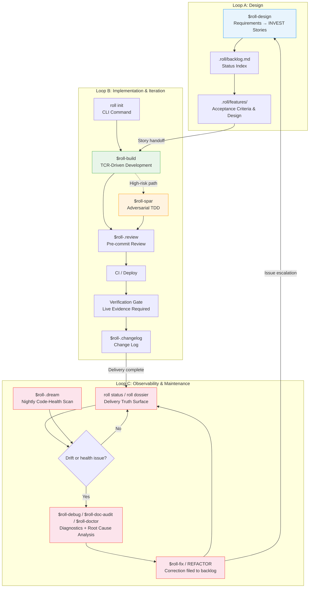
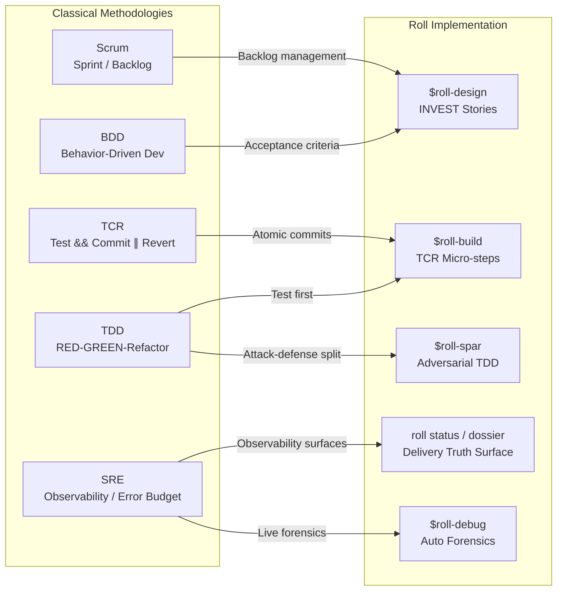

# Roll Engineering Methodology: A Standardized AI Agent Delivery Framework

> **Version:** 1.0
> **Date:** 2026-04-15
> **Status:** Internal Engineering Whitepaper

---

## Abstract

As AI coding assistants evolve from point tools into team infrastructure, engineering organizations face an underappreciated challenge: **inconsistent behavior across AI clients (Claude Code, Antigravity (agy), Cursor, Codex), fragmented environment configuration, and the absence of auditable quality gates on deliverables**. One developer writes code with Claude that passes local tests; another uses Cursor and bypasses those same tests — not because of a capability gap between the models, but because the two received entirely different engineering constraints.

Roll is an **instruction and workflow management framework for AI Agents**. It does not invent new methodology. Instead, it encodes proven software engineering practices (Scrum, TDD, TCR, SRE) as standardized, AI-executable Skill definitions, and enforces cross-client configuration consistency through a CLI tool.

This document describes Roll's three-loop engineering architecture and its corresponding technical implementation.

The name is the design philosophy: Roll (悟空), the shape-shifting trickster, gains discipline from the golden headband (_金箍_) without losing any of his power. Roll the framework takes the same position — AI Agent capability is not diminished by constraint. Standardized constraints are precisely what make that capability composable and transferable at team scale.

---

## 1. Architecture Overview: Three Interlocking Loops

Roll decomposes the software delivery lifecycle into three loops, each independently operable yet mutually reinforcing. Every loop inherits a set of classical methodologies and automates their execution through concrete Skills.



How the three loops interact:

- **Loop A → Loop B**: User Stories produced by the design loop flow into the implementation loop as execution units.
- **Loop B → Loop C**: Each delivery feeds the truth ledger, so the maintenance loop sees shipped / in-progress / queue / truth drift / release readiness as facts.
- **Loop C → Loop A**: Drift or code-health issues surfaced by the observability surfaces become `FIX-XXX` / `REFACTOR-XXX` entries; anything beyond a quick fix escalates back to the design loop for reassessment.

**Optional autonomous layer** (enabled via `roll loop on`): `roll-loop` executes pending BACKLOG items on a configurable schedule; `roll-.dream` scans code health nightly and produces `REFACTOR` entries. The human reads `roll status`, the Delivery Dossier, the external console, and truth signals (and the loop also rebuilds a generated morning report page from events/runs). The human retains sole authority over `roll-release`. See §9 for details.

---

## 2. Global Configuration Management (Configuration Infrastructure)

### 2.1 The Problem

In environments where multiple AI clients coexist, each client has its own configuration entry point (Claude reads `CLAUDE.md`, agy reads `GEMINI.md`). Maintaining these files manually leads to:

- **Behavioral drift**: Different AI clients on the same project enforce different coding standards.
- **Fragmented configuration**: Engineering constraints scattered across multiple locations, with updates prone to gaps.
- **Cross-project inconsistency**: New projects cannot inherit the organization's engineering standards.

### 2.2 Technical Implementation

Roll uses the `roll` CLI to centralize configuration management and distribute it atomically.

**2.2.1 Skill Mounting (`roll setup`)**

On first run, the CLI performs two operations:

1. **Establish a Single Source of Truth**: Copies global conventions (`conventions/global/`) and skill definitions (`skills/`) from the repository into `~/.roll/`, making it the sole authoritative configuration source on the machine.
2. **Per-skill symlinks**: Creates individual symlinks for each `roll-*` skill into each AI client's skills directory (`~/.claude/skills/roll-*`, `~/.gemini/skills/roll-*`, etc.). Existing user skills are untouched — Roll skills are added alongside.

Setup never modifies any AI tool configuration files or global git settings. It is fully non-invasive and safe to re-run.

**2.2.2 Configuration Sync (rolled into `roll setup` — one command for everything)**

Distributes content from `~/.roll/` to each AI client's configuration path — conventions and skills in one step.

- **Conventions**: uses `@include` append mode — writes Roll conventions to `{ai_dir}/roll.md`, then appends a single `@roll.md` line to the user's main config. Existing content is never overwritten.
- **Skills**: refreshes skills from the repo into the local cache and creates/repairs per-skill symlinks for each client.

Append `--force` (or `-f`) to force-rewrite `roll.md` or rebuild symlinks.

```
~/.roll/conventions/global/
├── AGENTS.md        → ~/.kimi/roll.md (+ @roll.md appended to AGENTS.md)
├── CLAUDE.md        → ~/.claude/roll.md (+ @roll.md appended to CLAUDE.md)
├── GEMINI.md        → ~/.gemini/roll.md (+ @roll.md appended to GEMINI.md)
└── project_rules.md → (project-level distribution)
```

**2.2.3 Project-Level Configuration (`roll init`)**

`roll init` creates three workflow files in the current directory — instantly, with no prompts:

- `AGENTS.md` — global engineering constraints (copied from `~/.roll/conventions/global/`)
- `.roll/backlog.md` — empty task index
- `.roll/features/` — directory for story details and design documents

For **existing projects** (AGENTS.md already present), `roll init` re-merges the global conventions section-by-section, preserving all existing project-specific content.

Project-type templates (`conventions/templates/`) still exist as **reference material for skills** — `$roll-build` and `$roll-design` read them to infer conventions for a given project type. Users no longer select a type at init time.

### 2.3 Configuration Hierarchy

```
Organization (Global)    ← Coding standards, Git discipline, TCR workflow, test standards
  ↓ roll init (direct copy, no type selection)
Project Instance         ← AGENTS.md (constraints) + .claude/CLAUDE.md (client config)
  (skills infer type from existing files)
Project Type (Template)  ← Reference only — consulted by $roll-build / $roll-design at runtime
```

---

## 3. Loop A: Product Definition and Requirements Design

### 3.1 Methodology Inheritance

| Classical Methodology | Roll Implementation |
|----------------------|--------------------|
| BDD (Behavior-Driven Development) | `$roll-design`: Requirements expressed as Acceptance Criteria |
| Scrum Backlog | `.roll/backlog.md` + `.roll/features/`: Two-tier index structure |
| INVEST Principles | Mandatory constraints on Story decomposition |

### 3.2 From Idea to BACKLOG: `$roll-design`

Translates raw ideas and business requirements into executable instruction contracts. The journey from an undeveloped thought to a BACKLOG Story follows a staged, gate-controlled flow:

```
Clarify → Discuss → [peer: direction] → Analyze+DDD → Design → [peer: plan] → Split → Write
```

**Clarify** — When input is vague, `$roll-design` summarizes intent, assesses complexity, and asks 3–5 targeted questions. Nothing proceeds until the scope is clear.

**Discuss** — When the approach is uncertain, the skill enters a multi-turn conversation. It leads with an opinionated recommendation rather than a full comparison menu, follows the user's thread when they want to dig into a specific option, and explicitly surfaces hidden assumptions. The discussion runs as many rounds as needed. When a direction crystallizes, the skill names the conclusion and asks — *"Continue to solution design, or keep exploring?"* — then waits for an explicit answer before moving on.

**Direction Review** (`$roll-peer`, optional) — For large-scope or cross-context decisions, a peer agent challenges the chosen direction before any DDD modeling begins. 10-second opt-out window. On REFINE/OBJECT, the discussion resumes.

**Analyze + DDD** — Scope is assessed and DDD depth is calibrated automatically: full Event Storming for greenfield projects, a Domain Slice for new features, a Domain Tag for bug fixes.

**Solution Design** — Architecture and module decomposition written to `.roll/features/<feature>-plan.md`. Greenfield Tactical Models (Aggregates, Entities, Invariants, Domain Events) written to `.roll/domain/`.

**Plan Review** (`$roll-peer`, optional) — For large-scope work, a peer agent reviews the complete plan before Stories are split. Same opt-out behavior.

**Split + Write** — The plan is decomposed into INVEST-compliant User Stories, written to `.roll/features/<feature>.md` with full AC, and indexed in `.roll/backlog.md`. The human confirms before `$roll-build` is invoked.

The core output is User Stories that conform to the **INVEST principles**:

| Principle | Requirement |
|-----------|-------------|
| **I**ndependent | Each Story can be delivered independently with no cross-dependencies |
| **N**egotiable | Defines acceptance criteria, not implementation details |
| **V**aluable | Each Story delivers perceptible user value |
| **E**stimable | Implementation scope is assessable; Action granularity is 2–5 minutes |
| **S**mall | A single Story can be completed within one session cycle |
| **T**estable | Each Story includes verifiable acceptance criteria |

> **Scenario**: A product manager says "admins should be able to see everyone's activity logs." During Discuss, the skill asks: "Is this for compliance or operational monitoring? That changes whether we need tamper-proof storage." After direction is confirmed, `$roll-design` decomposes the requirement into three independent Stories: US-007 (write audit events), US-008 (audit list UI with filtering), and US-009 (export audit data as CSV).
>
> Each Story carries its own acceptance criteria — US-007's AC includes "create/delete/modify operations all generate audit events" and "events include actor ID, timestamp, and change diff." The export capability, which was buried implicitly in the original requirement, is surfaced as an explicit standalone Story rather than hidden in implementation details.

### 3.3 Management Artifacts: Two-Tier Index Structure

**`.roll/backlog.md` (status index)** — the project's central state machine. Contains only Story ID, title, and status summary; implementation details are excluded:

```markdown
## Stories
| ID     | Title                | Status |
|--------|----------------------|--------|
| US-001 | User login           | ✅ Done |
| US-002 | Role-based access    | 🔨 In Progress |
| US-003 | Audit logging        | 📋 Ready |
```

**`.roll/features/` (detailed design)** — each Story has two dedicated documents:

- `<feature>.md`: Full User Story including the Acceptance Criteria checklist.
- `<feature>-plan.md`: Technical design document with architectural decisions and implementation approach.

This separation keeps `.roll/backlog.md` concise and readable as a progress dashboard, while detailed design lives in a dedicated location.

> **Design principle — Markdown as Code**: In Roll, `.roll/backlog.md` and `.roll/features/` are not documentation artifacts generated after development — they are the planning input that drives development. A Story does not exist until it has a Markdown file. A Story is not delivered until merge evidence on `main` and Verification Gate evidence both exist. The file system is the durable planning record; truth projections reconcile it with git and evidence anchors.

---

## 4. Loop B: Automated Implementation and Continuous Integration

### 4.1 Methodology Inheritance

| Classical Methodology | Roll Implementation |
|----------------------|--------------------|
| TDD (Test-Driven Development) | Tests written first; RED → GREEN → Refactor |
| TCR (Test && Commit ∥ Revert) | `$roll-build`: commit on pass, revert on failure |
| DevOps / CI-CD | Objective arbitration layer: CI is the final authority on "deliverable"; minute-level feedback loops compress defect discovery cost |
| Defensive Programming | `$roll-spar`: adversarial TDD for high-risk paths |

### 4.2 Project Initialization: `roll init`

Diagnoses the current directory before choosing a path — see the adoption patterns ([patterns/](patterns/README.md)):

- **Seed** (empty dir): scaffold `AGENTS.md` + `.roll/` directly, no prompts.
- **PRD-only** (requirements docs, no source): point to design as a new-project path.
- **Graft** (existing code, no `.roll/`): surfaces `$roll-onboard`, which scans the code, asks a short clarification set, and writes `.roll/init-diagnosis.yaml` plus `.roll/onboard-plan.yaml` for review; `roll init --apply` then prints a planned-operation checkpoint, waits for confirmation before writing, and hands back to `roll next` — see [legacy-onboarding.md](legacy-onboarding.md).
- **Roll-ready / partial / pre-2.0 Roll**: print `roll status`, `roll init --repair`, or migration guidance without fresh-scaffolding over existing Roll markers.

Pre-2.0 projects (`BACKLOG.md` at root, `docs/features/`) should run `npx @seanyao/roll@2 migrate` first — see [migration-2.0.md](migration-2.0.md).

**What `roll init` creates:**

```
my-project/
├── AGENTS.md            # Engineering constraints (from global conventions)
└── .roll/
    ├── backlog.md       # Task index
    ├── features/        # Story details & design documents
    └── domain/          # DDD models, context map
```

Three files. Under 5 seconds. Run `roll setup` again to distribute conventions and skills to AI tool configs.

**Existing project (re-merge):**

When `AGENTS.md` already exists, `roll init` re-merges the global conventions section-by-section — adding any new sections from the global template while preserving all existing project-specific content.

**Project structure is inferred, not declared:**

Directory structure (`src/`, `api/`, `cmd/`, etc.) is created **on demand** by `$roll-build` and `$roll-design` as Stories are executed. Skills read existing project files (`package.json`, `go.mod`, directory layout) to infer conventions — the right structure emerges from evidence, not from an upfront type declaration.

Project-type templates (`conventions/templates/fullstack/`, `cli/`, etc.) remain available as reference material for skills to consult.

### 4.3 TCR-Driven Development: `$roll-build`

This is Roll's core execution unit. Its engineering significance lies in a fundamental shift: **correctness is not determined by the AI's own assertions, but exclusively by the pass/fail status of automated tests**.

**TCR (Test && Commit || Revert) execution flow:**

```
┌─────────────────────────────────────────────────────┐
│                  TCR Micro-Step                      │
├─────────────────────────────────────────────────────┤
│                                                      │
│  1. Write failing test (RED)                         │
│              │                                       │
│              ▼                                       │
│  2. Write minimal code to pass (GREEN)               │
│              │                                       │
│              ▼                                       │
│  3. Run tests ──── FAIL? ──── Revert changes         │
│              │                                       │
│            PASS                                      │
│              │                                       │
│              ▼                                       │
│  4. $roll-.review (self-review gate)                  │
│              │                                       │
│              ▼                                       │
│  5. git commit (micro-commit)                        │
│              │                                       │
│              └──── Back to Step 1, next Action       │
│                                                      │
└─────────────────────────────────────────────────────┘
```

Each Action is constrained to **2–5 minutes** of scope. The engineering rationale for this constraint:

- **Near-zero rollback cost**: Any failure discards at most a few minutes of work.
- **Errors do not compound**: Failing logic cannot be depended on by subsequent code, preventing hidden debt from accumulating in the codebase.
- **Observable progress**: The micro-commit sequence is itself a real-time record of delivery progress.

**The complete delivery pipeline** — `$roll-build` does not stop at local tests passing. It requires completing the full end-to-end delivery chain:

```
TCR Micro-commits → git push → CI Pass → Deploy → Verification Gate
```

The **Verification Gate** is the final checkpoint: it requires **live evidence** (test output screenshots, curl responses, browser screenshots). The AI's own assertions ("I confirmed it works") are not accepted.

That evidence now crystallizes into a per-story acceptance report — see [Acceptance Evidence (`roll attest`)](acceptance-evidence.md): per-AC verdicts, the no-evidence red line, and a single offline HTML non-engineers can audit.

> **Scenario**: Executing US-007 (write audit events).
>
> Action 1: Write a RED test for `AuditService.record()` asserting that task creation triggers an audit write → implement minimal code → GREEN → code-review passes → `tcr: audit event on task create`.
>
> Action 2: Write a RED test for delete operations → discover `TaskService.delete()` is missing a hook injection point → add the implementation → GREEN → commit.
>
> 4 micro-commits total, zero manual intervention throughout. CI triggers all GREEN, auto-deploys to staging. Verification Gate collects evidence: `curl /api/audit` returns the correct event list, screenshot archived, US-007 closed.

**Mechanical TCR enforcement** — The TCR contract is enforced by a pre-commit hook, not by convention alone. When `npm test` passes, the test runner writes a proof-of-pass record containing a Unix timestamp and the current working tree hash (`git write-tree`). Before any commit, the hook verifies two conditions: (1) the proof is no older than 60 seconds, and (2) the tree hash matches the current working tree. If either fails, the commit is blocked. This makes it physically impossible to commit untested code — rewriting commit messages after the fact cannot bypass it because the working tree hash would no longer match.

### 4.4 Continuous Integration / Continuous Delivery: The Fast Feedback Infrastructure

CI/CD is not an "add-on" to Roll — it is the **objective arbitration layer** for all of Loop B. Passing tests locally is a necessary condition, not a sufficient one. Local environments carry implicit dependencies, uncommitted state, and machine-specific configuration. CI re-executes the same code in a clean, deterministic environment, making it the final authority on whether something is truly deliverable.

**4.4.1 CI as Objective Arbiter**

TCR promises "commit on passing tests," but that promise only holds once it is validated at the CI layer:

```
Local GREEN ≠ Deliverable
CI GREEN    = Deliverable
```

CI's scope extends beyond running the test suite — it is a complete quality gate sequence:

| Check | Purpose |
|-------|---------|
| **Lint / Type Check** | Coding standards and type safety; prevents low-grade errors from reaching the main branch |
| **Unit & Integration Tests** | Regression assurance for business logic; corroborates local TCR results |
| **Coverage Gate** | Enforces coverage thresholds; prevents test debt accumulation |
| **Build Artifact** | Confirms the build artifact can be generated; rules out dependency resolution issues |
| **E2E Smoke** | Smoke validation of critical paths in a real environment |

If any check fails, the deployment pipeline halts automatically. There is no "deploy first, fix tests later" path.

**4.4.2 The Engineering Value of Fast Feedback Loops**

The later a defect is discovered, the more expensive it is to fix — this is not folk wisdom, it is an empirically supported engineering finding. A bug caught within 5 minutes of commit costs roughly the same as initial development to fix. Caught in a test environment, the cost multiplies by 10. Caught in production, by 100.

Roll's TCR + CI combination compresses the feedback window to **minutes**:

```
micro-commit (2–5 min granularity)
    → git push (immediate)
        → CI triggered (seconds)
            → result returned (minutes)
                → problem localized (to this exact commit)
```

The micro-step granularity constraint (2–5 min/Action) delivers a second benefit here: when CI fails, the amount of code to triage is minimal, and the root cause is almost always immediately obvious.

**4.4.3 The CI Pipeline and the Truth Ledger**

A Roll project's CI pipeline is triggered on every push / PR:

```
.github/workflows/
└── ci.yml          # Triggered on every push / PR
                    # Runs the complete quality gate sequence
                    # GREEN → unlocks CD deployment permission
                    # Records the run into the truth ledger
```

Every CI run is recorded into the same truth ledger that Loop C reads from. That is the infrastructure-level unity across all three loops: Loop C's observability surfaces (`roll status`, the Delivery Dossier, truth signals) are projections of the same delivery facts CI produces — not a separate monitoring system bolted on top.

**4.4.4 The CD and Verification Gate Dependency Chain**

The Verification Gate (live evidence acceptance) sits at the very end of Loop B, and its existence depends on a successful CD deployment:

```
CI PASS
  → CD: deploy to target environment
      → Verification Gate: collect evidence from the deployed version
          → screenshots / curl responses / test output
              → Story closed
```

Without CD there is no verifiable target, rendering the Verification Gate meaningless. This dependency chain ensures that **Story closure evidence must come from the live production environment, not a local simulation**.

---

### 4.5 Cross-Agent Code Review: `$roll-peer`

`$roll-peer` implements bilateral negotiation-style code review across AI clients. Supports arbitrary pairing between Claude, Kimi, DeepSeek, and Codex.

How it works: the initiating agent submits a change summary and diff; the receiving agent independently reviews and issues an APPROVE / REFINE / OBJECT verdict. REFINE triggers revision and re-review; OBJECT escalates to discussion. The `$roll-peer` skill owns the multi-round protocol; the `roll peer` CLI is the TS-native one-shot adapter that records structured reviewer facts in `.roll/peer/runs.jsonl` plus transcripts.

Automatic trigger: `$roll-design` optionally invokes `$roll-peer` during direction review and plan review phases, where a different agent challenges the chosen direction or complete plan.

### 4.6 Adversarial TDD: `$roll-spar`

For high-risk paths — authorization, payments, data integrity — standard TDD coverage is insufficient. Tests and implementation are written by the same Agent, creating cognitive blind spots. `$roll-spar` introduces an adversarial mechanism:

| Role | Responsibility | Constraint |
|------|---------------|------------|
| **Attacker** | Writes test cases designed to break the system | May not write any implementation code |
| **Defender** | Writes the minimal code to make tests pass | May not modify the Attacker's tests |

The adversarial cycle continues until the Attacker cannot produce a new RED test for two consecutive rounds, or all predefined scenarios are covered (maximum 5 rounds). Each round's results are committed independently, keeping the adversarial process fully traceable.

Automatic trigger signals: when a Story touches authentication/authorization, payment/billing, data integrity validation, complex state machines, or historically high-defect modules, `$roll-build` automatically routes the Action to `$roll-spar`.

> **Scenario**: US-010 (organization member permission changes) triggers the `$roll-spar` auto-route.
>
> The Attacker's first round produces 3 RED tests: a regular member escalating privileges to modify another's role, whether an admin can continue operating after demoting themselves, and concurrent requests simultaneously modifying the same user's role. After the Defender implements passing code for all three, the Attacker's second round adds: if a role change succeeds at the DB level but the notification fails, does the permission atomically roll back?
>
> On round three, the Attacker cannot produce any new RED tests — the adversarial session ends. Test coverage on the permission module rises from the typical TDD baseline of 71% to 93%.

### 4.7 Delivery Traceability

After each successful deployment, two mechanisms ensure deliverables remain traceable:

- **`$roll-.changelog`**: Automatically extracts completed Stories from `.roll/backlog.md`, filters out internal technical details, and generates a user-facing changelog.
- **`Co-Authored-By` trailer (AI source tagging)**: AI tools (Claude Code, Codex, Cursor, etc.) natively append a `Co-Authored-By: <Model> <email>` trailer on commit. In multi-Agent workflows, `git log` shows the actual executor of every commit at a glance.

---

## 5. Loop C: Observability and Maintenance

Loop C is observability and maintenance: status, dossier, debug/doc/doctor, dream code-health scans, and truth signals feed corrections back into the backlog.

### 5.1 Methodology Inheritance

| Classical Methodology | Roll Implementation |
|----------------------|--------------------|
| SRE (Site Reliability Engineering) | `roll status` / `roll dossier`: delivery truth surface from a single ledger |
| Observability | The external console + truth signals (truth.json / release readiness / `roll loop status`) |
| Continuous maintenance | `$roll-.dream`: nightly code-health scans that file `REFACTOR-XXX` entries |
| Digital Forensics + RCA | `$roll-debug` / `$roll-doc-audit` / `$roll-doctor`: project-owned diagnostics, documentation, and toolchain health |

### 5.2 Delivery Truth Surface: `roll status` / `roll dossier`

Loop C is not production patrol. It is the mature delivery-control surface: it reads from a single truth ledger and presents shipped / in-progress / queue / truth drift / release readiness as **facts**, not assertions.

**The observability surfaces:**

| Surface | What it shows |
|---------|--------------|
| `roll status` | Sync status, skill links, detected AI tools, and the live delivery state |
| `roll dossier` | The Delivery Dossier — shipped / in-progress / queue / truth drift / release readiness in one place |
| External console | The same facts rendered as a browsable page for non-engineers |
| Truth signals | `truth.json`, release readiness, `roll loop status` — the machine-readable ledger underneath |

**Truth drift** — these surfaces reconcile the planning record (`.roll/backlog.md`, `.roll/features/`) against git history and acceptance evidence. When a Story is marked Done but lacks merge evidence on `main` or Verification Gate evidence, that mismatch shows up as drift on the dossier rather than passing silently.

**Corrections feed back to the backlog** — anything the surfaces reveal as a problem becomes a `FIX-XXX` or `REFACTOR-XXX` entry that re-enters the loop. Loop C → Loop A: anything beyond a quick fix escalates to design.

> **Scenario**: Following the TaskFlow v1.3 release, the owner opens `roll dossier`. The Delivery Dossier shows US-007 (audit write) as Done, but a truth-drift flag is raised: the latest acceptance evidence captured `GET /api/audit` returning audit events with an empty `timestamp` field, which contradicts US-007's AC ("events include a timestamp"). At the same time, the most recent `$roll-.dream` nightly scan flagged the serialization layer as a code-health hot spot after the v1.3 ORM upgrade.
>
> The drift is real, so `FIX-012: audit event timestamp is null` is filed to the Backlog. On the next loop cycle it is routed to `$roll-fix`, and the dossier's release-readiness signal stays red until the fix lands.

### 5.3 Automated Forensics and Root Cause Diagnosis: `$roll-debug`

A Playwright-based end-to-end debugger supporting two operating modes:

- **Native mode**: The target page has integrated the Black Box (BB) SDK; diagnostic data is collected directly via the SDK interface.
- **Universal mode**: No integration required on the target page; Playwright injects a collection script, enabling forensics on any web page.

Data dimensions collected automatically:

| Dimension | Collected Data |
|-----------|---------------|
| Console | Error logs, warnings, uncaught exceptions |
| Network | Request/response payloads, failed requests, slow requests |
| DOM | Page structure, render state, presence of critical elements |
| Performance | Load times, resource timing, interaction latency |
| Screenshot | Visual snapshot of the current page state |

After collection, `$roll-debug` performs structured multi-dimensional analysis (content state, network failures, DOM rendering anomalies, performance bottlenecks), outputting diagnostic conclusions and remediation recommendations.

> **Scenario (cont.)**: `$roll-debug` runs forensics on the audit list page. The Network dimension captures `GET /api/audit` returning 200 but with `timestamp` as `null`; the Console dimension simultaneously shows `[warn] AuditEvent serializer: missing timestamp`.
>
> `$roll-debug` consumes the diagnostic JSON and isolates the root cause: the v1.3 ORM upgrade introduced a field alias change that was not reflected in the serialization layer, breaking the `created_at` → `timestamp` mapping. The fix direction is clear; handed off to `$roll-fix`.

### 5.4 Regression Repair: `$roll-fix`

Executes a fix for a single issue — lighter-weight than `$roll-build`, but held to the same quality standards:

- **Mandatory regression tests**: Every fix patch must include a regression test case targeting the specific issue, preventing recurrence.
- **Scope constraint**: One Fix handles one issue. If the fix reveals a scope wider than expected, it escalates to a User Story and re-enters Loop A.
- **Same quality gates**: Verification Gate, CI Pass, and production verification all apply equally.

> **Scenario (cont.)**: `$roll-fix` executes FIX-012, with scope strictly limited to the serialization layer field mapping. A regression test is added (asserting `timestamp` is non-null and conforms to ISO 8601 format).
>
> 1 commit, CI GREEN, post-deployment Verification Gate confirms the audit list timestamps have recovered, FIX-012 closed. The new acceptance evidence reconciles against US-007's AC, so on the next `roll dossier` refresh the truth-drift flag clears and the release-readiness signal returns to green.

---

## 6. Engineering Baseline: Engineering Common Sense

Roll defines 9 non-negotiable engineering baselines that apply across all three loops. These are not "best practice suggestions" — they are mandatory checks in the Test Design Review phase of every Story:

| # | Baseline | Definition | Anti-Pattern |
|---|----------|-----------|--------------|
| 1 | **Idempotency** | Executing the same operation N times yields the same result as executing it once | "This won't be called twice anyway" |
| 2 | **Cross-Module Contracts** | Shared IDs, formats, and algorithms are consistent across all modules | "The other side will handle the format conversion" |
| 3 | **Data Flow Integrity** | Producer → storage → consumer validated end-to-end | "As long as it's in the database it's fine" |
| 4 | **Atomicity** | On partial failure, perform a complete rollback — leave no intermediate state | "The failure probability is very low" |
| 5 | **Input Validation** | All external inputs (API, user, file) are validated at the boundary | "Internal calls don't need validation" |
| 6 | **Graceful Degradation** | When a dependency fails, degrade service rather than crash | "That service won't go down" |
| 7 | **Observability** | Progress, state, and errors are visible to the user | "It can be looked up in the logs" |
| 8 | **Concurrency Safety** | Shared resource access is safe under multi-thread / multi-process conditions | "We only have a single instance right now" |
| 9 | **Infer First, Confirm Intent** | Never ask the user for facts the machine can deduce; only ask the user to decide intent (keep / switch / merge) | "Just let the user pick — safer that way" |

**Baseline 9 expanded:** Before prompting the user, any tool must exhaust available context (files, config, environment). Present the inferred result as "confirm or override" — never ask users to fill in information from scratch when the system already has signals. Two modes:
- **new-scratch** (no context whatsoever): a selection menu is the correct prompt
- **legacy-auto** (code, config, or metadata exists): scan → infer → ask only "keep [Y] or switch [1-4]?"

The full menu is a fallback, not the default entry point. An `--auto` / `auto` argument is reserved for non-interactive CI/script use.

---

## 7. Passive Support Skills

Beyond the active Skills in the three loops, Roll includes a set of passively triggered support skills:

| Skill | Trigger | Purpose |
|-------|---------|---------|
| `$roll-.echo` | When user input is ambiguous or contradictory | Restates intent and resolves ambiguity before proceeding, avoiding wasted compute on a misunderstood instruction |
| `$roll-.clarify` | When the request needs scope boundaries (what/who/where) | Summarizes intent and asks 3–5 targeted questions before design begins |
| `$roll-.review` | After each TCR micro-step completes | Multi-dimensional self-review (security, maintainability, performance, scope); a Critical finding blocks the commit |
| `$roll-.qa` | During the Test Design Review phase | Defines the test pyramid (Unit > E2E > Visual > Smoke) and enforces coverage thresholds |
| `$roll-.changelog` | After a successful deployment | Extracts completed items from BACKLOG and generates a user-readable changelog |

---

## 8. Relationship to Classical Methodologies

Roll is not a new methodology. It encodes proven engineering practices as standardized instructions that AI Agents can understand and execute.



The key distinction lies in the shift of execution subject: these methodologies originally depended on engineers' personal discipline (humans tire, humans cut corners). Roll hardens them into instruction constraints for AI Agents — an Agent will never "skip the tests just this once," because that branch does not exist in the Skill definition.

---

## 9. Autonomous Evolution Layer (Optional)

### 9.1 Design Principle

The three-loop architecture (Loop A → B → C) describes how a human developer works *with* Roll. The autonomous evolution layer is a **separate, optional overlay** that lets the agent continue working without the human present — picking up pending BACKLOG items and reflecting on code health nightly, while keeping the delivery truth surface up to date for the human to read on their own schedule.

It is off by default. Enabling it requires an explicit `roll loop on`.

```
┌─────────────────────────────────────────────────────────┐
│  Base layer (always active)                             │
│  $roll-design → $roll-build → $roll-fix → $roll-spar   │
│  Human drives every action                              │
├─────────────────────────────────────────────────────────┤
│  Autonomous layer (opt-in: roll loop on)                │
│  roll-loop   — BACKLOG executor (configurable schedule)  │
│  roll-.dream — nightly code health scan                 │
│  Human reads status / dossier / console; release stays human │
└─────────────────────────────────────────────────────────┘
```

### 9.2 Components

**`roll-loop`** — Runs on a configurable schedule via macOS launchd (Linux: crontab). Scans BACKLOG for `📋 Todo` items and routes them: `US-XXX → $roll-build`, `FIX-XXX → $roll-fix`, `REFACTOR-XXX → $roll-build`. Caps items per run to limit blast radius. Rebuilds the generated morning report page from events/runs as it goes. Built-in TCR enforcement: after a story completes, checks for `tcr:` micro-commits — if zero are found, reverts the story to Todo with an ALERT, preventing agents from skipping the TCR rhythm.

**`roll-.dream`** — Runs nightly (03:00 local) via macOS launchd (Linux: crontab). Scans the codebase for dead code, architectural drift against `.roll/domain/`, pruning candidates, and emerging patterns. Outputs `REFACTOR-XXX` entries to BACKLOG and a log to `.roll/dream/YYYY-MM-DD.md`.

**Reading delivery state** — There is no owner-brief skill. The human reads `roll status`, the Delivery Dossier (`roll dossier`), the external console, and truth signals (`roll loop status`) on their own schedule; the loop also rebuilds a generated morning report page — one fixed page reconstructed from events/runs, not a personalized digest. This is distinct from `roll-.changelog` (the user-facing changelog).

### 9.3 Why Local Scheduling, Not GitHub Actions

GitHub Actions runs on remote servers with no access to the local codebase, local test runner, or local agent CLI. The TCR loop — which is the core of `$roll-build` — requires local execution. Using GitHub Actions would mean the agent could only read the repo as a snapshot, not run tests, not observe the dev environment.

On macOS, Roll uses **launchd** (plists installed to `~/Library/LaunchAgents/`); on Linux, crontab. `roll loop on` automatically installs scheduling for both services (loop/dream); `roll loop off` removes them.

```bash
# macOS launchd plists (auto-generated, no manual editing needed)
~/Library/LaunchAgents/com.roll.loop.<project-slug>.plist
~/Library/LaunchAgents/com.roll.dream.<project-slug>.plist
```

`roll loop status` provides the scheduler snapshot: launchd status, current execution state, pending queue, alerts, and recent run history. For the live terminal, attach directly with `tmux attach -t roll-loop-<project-slug>`.

If the agent supports native scheduling (e.g. Claude Code hooks), that is preferred over raw launchd/cron for cleaner lifecycle management.

### 9.4 Per-Machine Agent Routing

Agent selection is **per-machine**, via `.roll/agents.yaml` — four complexity
slots, each mapped to a locally-installed agent:

```yaml
# .roll/agents.yaml (per-machine; never committed)
schema: v3
easy:     { agent: pi }
default:  { agent: pi }
hard:     { agent: claude }
fallback: { agent: kimi }
```

A story's `est_min` picks the tier (easy ≤ 8 < default ≤ 20 < hard); the tier
slot picks the agent. When a tier's slot is empty, routing falls back to the
`default` slot → the `local.yaml` single-agent default (non-loop contexts'
preference, if present) → the first installed agent. `roll agent use <name>`
updates the slots. There is no per-tier override outside `agents.yaml` — one
project field never collapses the complexity tiers onto a single agent.

### 9.5 Human Authority

The autonomous layer **never** invokes `roll-release`. Production deployment is always a human decision, made after reading the delivery truth surface and optionally inspecting the diff. The Delivery Dossier (`roll dossier`) provides:

- What the agent completed since the human last looked
- Any escalations that require human input
- A release-readiness signal (heuristic, not a gate)

This keeps the human informed without requiring them to be present for every step.

### 9.6 CLI Management

```bash
roll loop on|off          # enable / disable scheduled execution for this project
roll loop now             # trigger one cycle immediately
roll loop status          # show scheduler state + any ALERT
roll dossier              # show the Delivery Dossier (shipped / queue / drift / release readiness)
roll agent use <name>     # switch this project's agent
roll agent list           # show installed agents
roll                      # project dashboard (in project dir): loop status + dossier summary
```

---

## 10. Limitations and Current State

**Validated:**

- Feedback-driven continuous delivery loop (Design → Build → Check → Fix)
- A standardized skill set spanning the three loops (active delivery skills + passive support skills)
- Cross-AI-client configuration consistency management (`roll` CLI)
- TCR micro-commits + Verification Gate quality assurance mechanism
- Multi-Agent audit tracing via `Co-Authored-By` trailers (written natively by each AI tool)

**Current Limitations:**

- **Multi-Agent coordination overhead**: `$roll-build` evaluates Action dependencies to determine whether to launch parallel sub-Agents, but cross-Agent state synchronization and conflict resolution currently depend on conventions rather than enforced protocols, incurring coordination overhead in high-concurrency scenarios.
- **Framework coupling**: Skill definitions are written in Markdown and rely on AI clients' ability to interpret natural language instructions — execution precision varies across different models. Each Skill now pins a model in its frontmatter (`model:` — e.g. Opus for `roll-design`, Haiku for `roll-idea`) and declares a tool allowlist (`allowed-tools:`), mitigating precision drift and accidental tool misuse, though both fields still depend on the client honoring them.
- **Observability is reactive**: Loop C's truth surfaces (`roll status` / `roll dossier`) and `$roll-.dream` scans surface drift and code-health issues from delivery facts and nightly analysis, but they do not continuously re-exercise shipped features the way a live regression suite would — a regression that produces no new evidence and no failing test can persist until the next acceptance run or scan touches it.

---

## Appendix A: Skill Quick Reference

| Skill | Phase | Input | Output |
|-------|-------|-------|--------|
| `$roll-design` | Design | Requirements description | `.roll/backlog.md` + `.roll/features/` |
| `$roll-build` | Implementation | Story ID / one-sentence requirement | Deployed code + verification evidence |
| `$roll-spar` | Defensive implementation | Feature description | Adversarial test suite + implementation code |
| `$roll-fix` | Bug fix | Fix ID | Fix code + regression test |
| `$roll-release` | Release | — | Version + tag + npm publish + GitHub Release |
| `$roll-peer` | Code review | Change diff | APPROVE / REFINE / OBJECT verdict |
| `$roll-debug` | Debugging & Diagnosis | URL | Diagnostic JSON + screenshots + root cause analysis |
| `$roll-doc-audit` | Docs/product audit | Codebase + docs/site/help | Drift findings + docs inventory + draft fills |
| `$roll-doctor` | Toolchain health | Install state | Conventions sync / skill health / config validity report |
| `$roll-loop` | Autonomous execution | BACKLOG todos | Completed Story / Fix / Refactor |
| `$roll-.dream` | Autonomous scan | Codebase | REFACTOR entries + scan log |

## Appendix B: CLI Command Quick Reference

Commands fall into two categories: bash commands run pure shell logic; agent commands (🤖) launch a full AI agent session to execute a SKILL.md.

| Command | Purpose |
|---------|---------|
| `roll setup [-f]` | First-time install on this machine, or re-sync (use `--force` to overwrite local cache) |
| `roll update` | One-step upgrade: detects install method (curl/npm/git) and upgrades accordingly, then re-sync |
| `roll init` | Create `AGENTS.md` + `.roll/` scaffold (`backlog.md`, `features/`, `domain/`) in cwd; surfaces `$roll-onboard` for legacy code; re-merges if `AGENTS.md` exists |
| `roll status` | Display current sync status, skill links, and detected AI tools |
| `roll backlog` | Show all pending tasks from `.roll/backlog.md` |
| `roll agent [use <name>\|list]` | Per-project agent selection — affects all 🤖 commands |
| `roll loop <on\|off\|now\|status\|runs\|log\|story\|events\|eval\|signals\|pause\|resume\|reset\|gc>` | 🤖 Manage the autonomous BACKLOG executor (three lanes: loop/dream/pr) |
| `roll dossier` | Show the Delivery Dossier: shipped / in-progress / queue / truth drift / release readiness |
| `roll pair [init\|status]` | 🤖 Cross-agent pairing: heterogeneous peer re-checks during builds |
| `roll release [ship\|waiver]` | Release guidance · gated tag push · recorded drift waiver — npm publish stays human |
| `roll` (no args, in project dir) | Dashboard: loop status, pending count, latest dossier summary |
