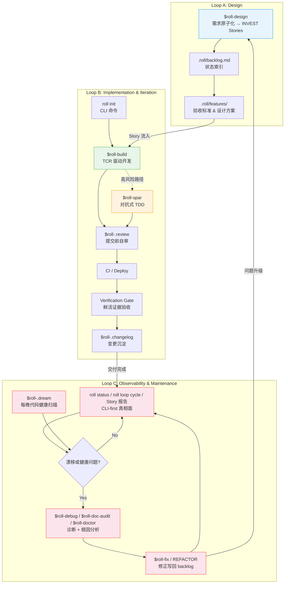
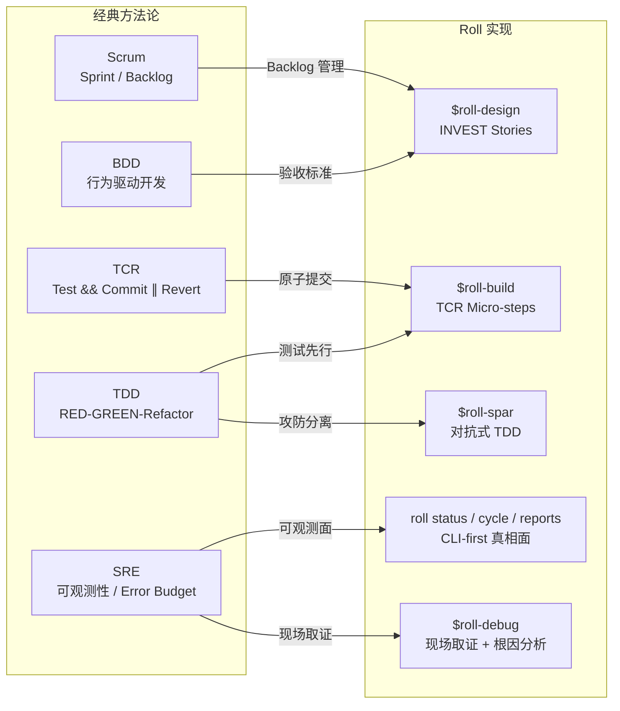

# Roll 工程方法论：基于 AI Agent 的标准化交付流

> **Version:** 1.0  
> **Date:** 2026-04-15  
> **Status:** Internal Engineering Whitepaper
---

## 摘要

当 AI 编程助手从单点工具进化为团队基础设施时，工程组织面临一个被低估的问题：**不同 AI 客户端（Claude Code, Antigravity (agy), Cursor, Codex）的行为标准不一致、环境配置碎片化、交付物缺乏可审计的质量门禁**。一个开发者用 Claude 写的代码通过了本地测试，另一个用 Cursor 写的代码绕过了同一测试——不是因为 AI 能力差异，而是因为它们接收到的工程约束完全不同。

Roll 是一个面向 AI Agent 的**指令与工作流管理框架**。它不发明新的方法论，而是将经典软件工程实践（Scrum、TDD、TCR、SRE）编码为 AI 可执行的标准化技能集（Skills），并通过 CLI 工具实现跨客户端的配置一致性。

本文档描述 Roll 的三层工程闭环架构及其对应的技术实现。

命名即设计哲学：悟空拥有无限变化的能力，金箍赋予他约束与纪律，而能力本身分毫不减。Roll 框架的核心主张正在于此——AI Agent 的能力不因约束而削弱，恰恰相反，标准化的约束让这种能力在团队规模下可组合、可传递、可审计。

---

## 1. 架构总览：三层工程闭环

Roll 将软件交付生命周期分解为三个可独立运转、又彼此反馈的闭环。每个闭环继承一组经典方法论，并通过具体的 Skill 实现自动化执行。



三个闭环的协同关系：

- **Loop A → Loop B**：设计闭环产出的 User Story 流入实现闭环作为执行单元。
- **Loop B → Loop C**：每次交付都喂入真相账本，维护闭环因此把已交付 / 进行中 / 队列 / 真相漂移 / 发布就绪当作事实读取。
- **Loop C → Loop A**：可观测面浮现的漂移或代码健康问题转为 `FIX-XXX` / `REFACTOR-XXX` 条目；超出快速修复范围的，升级回设计闭环重新评估。

**可选自主层**（通过 `roll loop on` 启用）：`roll-loop` 按可配置频次执行 BACKLOG 待办；`roll-.dream` 每晚扫描代码健康并产出 `REFACTOR` 条目。人类自行查阅 CLI-first 入口（`roll status`、`roll loop watch`、`roll loop cycle`、告警和 Story 报告）。人类保留 `roll-release` 的唯一权力。详见 §9。

---

## 2. 全局配置管理 (Configuration Infrastructure)

### 2.1 解决的问题

在多 AI 客户端并存的开发环境中，每个客户端有独立的配置入口（Claude 读 `CLAUDE.md`，Antigravity 读 `GEMINI.md`）。手动维护这些文件会导致：

- **行为漂移**：同一项目中不同 AI 客户端执行不同的代码规范。
- **配置碎片化**：工程约束散落在多个位置，更新时容易遗漏。
- **项目间不一致**：新项目无法继承组织级的工程标准。

### 2.2 技术实现

Roll 通过 `roll` CLI 工具实现配置的集中管理与原子化分发。

**2.2.1 指令集挂载 (`roll setup`)**

首次执行时，CLI 完成两项工作：

1. **建立 Single Source of Truth**：将仓库中的全局约定（`conventions/global/`）和技能定义（`skills/`）复制到 `~/.roll/`，作为本机唯一的配置源。
2. **按 skill 逐个软链**：为 `~/.roll/skills/` 中每个 `roll-*` 技能单独创建符号链接，挂载到各 AI 客户端目录（`~/.claude/skills/roll-*`、`~/.gemini/skills/roll-*` 等）。用户已有的 skills 不受影响，Roll skills 独立并存。

setup 不修改任何 AI 工具的配置文件，也不改变全局 git 配置，保证零侵入。

**2.2.2 配置同步（已合并到 `roll setup` —— 一条命令完成所有同步）**

将 `~/.roll/` 中的约定与技能一步分发到各 AI 客户端配置路径。

- **约定**：以 `@include` 追加模式分发 — 将 Roll 约定写入 `{ai_dir}/roll.md`，并在用户主配置末尾追加一行 `@roll.md`，原有内容永远不被覆盖。
- **技能**：从仓库刷新 skills 到本地缓存，并创建/修复各客户端的 per-skill symlink。

加上 `--force`（或 `-f`）可强制重写 `roll.md` 或重建 symlink。

```
~/.roll/conventions/global/
├── AGENTS.md        → ~/.kimi/roll.md (+ @roll.md appended to AGENTS.md)
├── CLAUDE.md        → ~/.claude/roll.md (+ @roll.md appended to CLAUDE.md)
├── GEMINI.md        → ~/.gemini/roll.md (+ @roll.md appended to GEMINI.md)
└── project_rules.md → (项目级分发)
```

**2.2.3 项目级配置 (`roll init`)**

`roll init` 会先诊断当前目录，再选择最安全的接入路径：

- **Seed**：创建 `AGENTS.md` + `.roll/` 作为最小起点，并提示下一步
  design/backlog 动作。
- **PRD-only**：保留需求/brief 作为事实源，并交给 design。
- **已有代码库**：先进入 onboard 诊断和 apply 检查点，再写入项目变更。

对于**已有项目**（AGENTS.md 已存在），`roll init` 按节（section）重新合并全局约定，保留所有已有的项目特定内容。

项目类型模板（`conventions/templates/`）作为 **skills 的参考资料**继续存在——`$roll-build` 和 `$roll-design` 读取它们来推断对应项目类型的约定。用户不再需要在 init 时声明类型。

### 2.3 配置层次结构

```
组织级 (Global)    ← 代码规范、Git 纪律、TCR 流程、测试标准
  ↓ roll init（直接注入，无类型选择）
项目实例 (Project)  ← AGENTS.md（约束）+ .claude/CLAUDE.md（客户端配置）
  （skills 按需从现有文件推断类型）
项目类型 (Template) ← 仅供参考——由 $roll-build / $roll-design 运行时读取
```

---

## 3. Loop A：产品定义与需求设计

### 3.1 方法论继承

| 经典方法论 | Roll 中的实现 |
|-----------|------------|
| BDD (行为驱动开发) | `$roll-design`：需求以验收标准（AC）形式定义 |
| Scrum Backlog | `.roll/backlog.md` + `.roll/features/`：两层索引结构 |
| INVEST 原则 | Story 拆分的强制约束 |

### 3.2 从想法到 BACKLOG：`$roll-design`

将原始想法和业务需求转化为 AI 可执行的指令契约。从一个未成形的念头到 BACKLOG Story，经历一套有门控的分阶段流程：

```
Clarify → Discuss → [peer: 方向评审] → Analyze+DDD → Design → [peer: 方案评审] → Split → Write
```

**Clarify（澄清）** — 输入模糊时，`$roll-design` 先总结意图、评估复杂度、提出 3–5 个定向问题，等用户回复后才继续。

**Discuss（讨论）** — 方向不确定时，进入多轮对话模式。技能给出有立场的推荐，而非一次性罗列所有选项；跟住用户的追问线索深入挖掘；显式点名隐藏假设。讨论可以持续任意轮。当方向收敛后，技能明确说出结论，然后问——*「继续进入设计，还是继续聊？」*——等到用户显式确认才往下走。

**方向评审**（`$roll-peer`，可选）— 大范围需求或跨 Bounded Context 的决策，在 DDD 建模开始前，由 peer agent 质疑所选方向。10 秒内未拒绝则自动触发。收到 REFINE/OBJECT 时，重新回到讨论。

**Analyze + DDD** — 自动判断范围并校准 DDD 深度：Greenfield 项目进行完整 Event Storming，新特性做 Domain Slice（定位 Context、Aggregate、Domain Event），Bug Fix 仅做 Domain Tag（一行定位）。

**Solution Design（方案设计）** — 架构设计和模块拆分写入 `.roll/features/<feature>-plan.md`。Greenfield 项目的 Tactical Model（Aggregate、Entity、不变式、Domain Event）写入 `.roll/domain/`。

**方案评审**（`$roll-peer`，可选）— 大范围需求在拆 Story 前，由 peer agent 审查完整方案。行为与方向评审一致。

**Split + Write** — 方案拆解为符合 INVEST 原则的 User Story，写入 `.roll/features/<feature>.md`（含完整 AC），并在 `.roll/backlog.md` 中追加索引行。用户确认后才触发 `$roll-build`。

核心输出是符合 **INVEST 原则** 的 User Story：

| 原则 | 要求 |
|------|------|
| **I**ndependent | 每个 Story 可独立交付，不存在交叉依赖 |
| **N**egotiable | 定义验收标准而非实现细节 |
| **V**aluable | 每个 Story 交付可感知的用户价值 |
| **E**stimable | 实现范围可评估，Action 粒度 2–5 分钟 |
| **S**mall | 单个 Story 可在一个会话周期内完成 |
| **T**estable | 每个 Story 附带可验证的验收标准 |

> **场景**：产品经理说"管理员能看到所有人的操作记录"。Discuss 阶段，技能先问："这是合规要求还是运营监控？两者对存储的防篡改要求不同。"方向确认后，`$roll-design` 将需求拆解为三个独立 Story：US-007（写入审计事件）、US-008（审计列表 UI，支持过滤）、US-009（审计数据导出 CSV）。
>
> 每个 Story 附带独立的验收标准——US-007 的 AC 包括"创建/删除/修改操作均生成审计事件"和"事件包含操作者 ID、时间戳、变更 diff"。原始需求中隐含的"导出"功能被显式化为独立 Story，而非藏在实现细节里。

### 3.3 管理载体：两层索引结构

**`.roll/backlog.md`（状态索引）**——项目的核心状态机。仅保留 Story ID、标题和状态摘要，不包含实现细节：

```markdown
## Stories
| ID     | Title                | Status |
|--------|----------------------|--------|
| US-001 | User login           | ✅ Done |
| US-002 | Role-based access    | 🔨 In Progress |
| US-003 | Audit logging        | 📋 Ready |
```

**`.roll/features/`（详细设计）**——每个 Story 对应两份文档：

- `<feature>.md`：User Story 详情，包含验收标准（AC）清单。
- `<feature>-plan.md`：技术设计方案，包含架构决策和实现路径。

这种分离确保 `.roll/backlog.md` 保持简洁可读（作为进度看板），同时详细设计有独立的存放位置。

> **设计理念 — Markdown 即代码**：在 Roll 中，`.roll/backlog.md` 和 `.roll/features/` 不是开发完成后生成的文档产物——它们是驱动开发的规划输入。Story 没有对应 Markdown 文件就等于不存在；Story 必须同时具备 `main` 上的 merge 证据和 Verification Gate 证据，才算已交付。文件系统是持久规划记录；真相投影会把它与 git、证据锚点对账。

---

## 4. Loop B：自动化实现与持续集成

### 4.1 方法论继承

| 经典方法论 | Roll 中的实现 |
|-----------|------------|
| TDD (测试驱动开发) | 测试先行，RED → GREEN → Refactor |
| TCR (Test && Commit ∥ Revert) | `$roll-build`：测试通过即提交，失败即回滚 |
| DevOps / CI-CD | 客观仲裁层：CI 作为"可交付"的最终裁定者；分钟级反馈回路压缩问题发现成本 |
| 防御性编程 | `$roll-spar`：对抗式 TDD 覆盖高风险路径 |

### 4.2 项目初始化：`roll init`

先诊断当前目录，再选择路径 —— 见 [patterns/](patterns/README.md)：

- **Seed（空目录）**：创建 `AGENTS.md` + `.roll/` 作为最小起点，并提示下一步
  design/backlog 动作。
- **PRD-only（只有需求文档、无源码）**：保留需求/brief 作为事实源，并作为新项目路径指向设计。
- **Graft（已有代码且无 `.roll/`）**：引导执行 `$roll-onboard`，扫描代码、问澄清问题、产出 `.roll/init-diagnosis.yaml` 与 `.roll/onboard-plan.yaml` 供审阅；`roll init --apply` 随后打印计划操作检查点、写入前等待确认，并交回 `roll next` 接续 —— 见 [legacy-onboarding.md](legacy-onboarding.md)。
- **已初始化 / 部分 Roll / pre-2.0 Roll**：分别打印 `roll status`、`roll init --repair` 或迁移建议，不在已有 Roll 标记上强行叠加骨架。

2.0 之前的项目（`BACKLOG.md` 在根目录、`docs/features/`）需要先跑 `npx @seanyao/roll@2 migrate` —— 见 [migration-2.0.md](migration-2.0.md)。

**`roll init`（seed 模式）创建的内容：**

```
my-project/
├── AGENTS.md            # 工程约束（来自全局约定）
└── .roll/
    ├── backlog.md       # 任务索引
    ├── features/        # Story 详情与设计文档
    └── domain/          # DDD 模型、context map
```

之后再次执行 `roll setup` 即可把约定与技能分发到各 AI 工具配置。

**项目结构按需推断，而非预先声明：**

目录结构（`src/`、`api/`、`cmd/` 等）由 `$roll-build` 和 `$roll-design` 在执行 Story 时**按需创建**。Skills 读取已有的项目文件（`package.json`、`go.mod`、目录布局）来推断约定——正确的结构从证据中浮现，而非来自初始化时的类型声明。

项目类型模板（`conventions/templates/fullstack/`、`cli/` 等）继续保留，作为 skills 的参考资料。

### 4.3 TCR 驱动开发：`$roll-build`

这是 Roll 的核心执行单元。其工程意义在于：**不依赖 AI 的自述来判断代码正确性，而是以自动化测试的通过状态作为提交的唯一准则**。

**TCR (Test && Commit || Revert) 的执行逻辑：**

```
┌─────────────────────────────────────────────────────┐
│                  TCR Micro-Step                      │
├─────────────────────────────────────────────────────┤
│                                                      │
│  1. Write failing test (RED)                         │
│              │                                       │
│              ▼                                       │
│  2. Write minimal code to pass (GREEN)               │
│              │                                       │
│              ▼                                       │
│  3. Run tests ──── FAIL? ──── Revert changes         │
│              │                                       │
│            PASS                                      │
│              │                                       │
│              ▼                                       │
│  4. $roll-.review (自审门禁)                           │
│              │                                       │
│              ▼                                       │
│  5. git commit (micro-commit)                        │
│              │                                       │
│              └──── 回到 Step 1，下一个 Action          │
│                                                      │
└─────────────────────────────────────────────────────┘
```

每个 Action 的粒度被限制在 **2–5 分钟**。这个约束的工程意义：

- **回滚成本极低**：任何一步失败，丢弃的代码量不超过几分钟的工作量。
- **错误不堆叠**：失败的逻辑不会被后续代码依赖，不会在代码库中形成隐性债务。
- **进度可观测**：micro-commit 序列本身就是交付进度的实时记录。

**完整交付管线**——`$roll-build` 不止于本地测试通过。它要求完成端到端的交付链：

```
TCR Micro-commits → git push → CI Pass → Deploy → Verification Gate
```

**验证门禁（Verification Gate）** 是最后一道关卡：要求提供**鲜活证据**（测试输出截图、curl 响应、浏览器截图），AI 的自述（"I confirmed it works"）不被接受。

这些证据现在会固化成每个 story 的验收报告——见[验收证据（`roll attest`）](acceptance-evidence.md)：逐条 AC 判定、零证据红线、一个非工程角色也能审计的离线单文件 HTML。

> **场景**：执行 US-007（写入审计事件）。
>
> Action 1：为 `AuditService.record()` 写 RED 测试，断言任务创建时触发审计写入 → 实现最小代码 → GREEN → code-review 通过 → `tcr: audit event on task create`。
>
> Action 2：为删除操作写 RED 测试 → 发现 `TaskService.delete()` 缺少 hook 注入点 → 补充实现 → GREEN → commit。
>
> 共 4 个 micro-commit，全程无人工介入。CI 触发全部 GREEN，自动部署到 staging，Verification Gate 取证：`curl /api/audit` 返回正确事件列表，截图存档，US-007 关闭。

### 4.4 持续集成/持续交付：快速反馈基础设施

CI/CD 不是 Roll 的"附加功能"，而是整个 Loop B 的**客观仲裁层**。TCR 在本地通过只是必要条件，不是充分条件——本地环境有隐性依赖、有未提交的状态、有只存在于开发机的配置。CI 在干净的、确定性的环境中对同一套代码重新执行，是"可交付"的最终裁定者。

**4.4.1 CI 作为客观裁判**

TCR 的承诺是"测试通过即提交"，但这个承诺只有在 CI 层被验证后才真正成立：

```
本地 GREEN ≠ 可交付
CI GREEN    = 可交付
```

CI 的职责边界不止于跑测试套件，而是一套完整的质量门禁序列：

| 检查项 | 作用 |
|--------|------|
| **Lint / Type Check** | 编码规范与类型安全，防止低级错误进入主干 |
| **Unit & Integration Tests** | 业务逻辑的回归保障，与本地 TCR 互为印证 |
| **Coverage Gate** | 覆盖率阈值强制执行，防止测试债务积累 |
| **Build Artifact** | 确认构建产物可正常生成，排除依赖解析问题 |
| **E2E Smoke** | 关键路径在真实环境的冒烟验证 |

任何一项失败，部署管线自动阻断。不存在"先部署再修测试"的操作路径。

**4.4.2 快速反馈回路的工程价值**

问题发现越晚，修复成本越高——这不是经验判断，而是有工程数据支撑的结论：代码提交后 5 分钟内发现的 Bug，修复成本约等于初次开发；进入测试环境后发现的，成本乘以 10；到达生产后，乘以 100。

Roll 的 TCR + CI 组合将反馈窗口压缩到**分钟级**：

```
micro-commit（2-5分钟粒度）
    → git push（立即）
        → CI 触发（秒级）
            → 结果返回（分钟级）
                → 问题定位（精确到这次提交）
```

微步提交的粒度约束（2–5 分钟/Action）在这里发挥了第二个价值：当 CI 失败时，需要回溯的代码量极小，问题根因几乎总是显而易见的。

**4.4.3 CI 管线与真相账本**

Roll 项目的 CI 管线在每次 push/PR 时触发：

```
.github/workflows/
└── ci.yml          # 每次 push/PR 触发
                    # 承担完整的质量门禁序列
                    # GREEN → 解锁 CD 部署权限
                    # 把本次运行记入真相账本
```

每一次 CI 运行都记入 Loop C 所读取的同一个真相账本。这正是三个闭环在基础设施层面的统一性：Loop C 的可观测面（`roll status`、`roll loop cycle`、Story 报告、真相信号）是 CI 产出的同一批交付事实的投影——而非另起一套监控系统外挂其上。

**4.4.4 CD 与 Verification Gate 的依赖链**

Verification Gate（鲜活证据验收）在整个 Loop B 中处于最末端，而它的存在以成功的 CD 为前提：

```
CI PASS
  → CD：部署到目标环境
      → Verification Gate：对已部署版本取证
          → 截图 / curl 响应 / 测试输出
              → Story 关闭
```

没有 CD 就没有可验证的目标，Verification Gate 就失去了意义。这条依赖链确保了：**Story 的关闭凭据必须来自线上真实环境，而非本地模拟。**

---

### 4.5 跨 Agent 代码评审：`$roll-peer`

`$roll-peer` 实现跨 AI 客户端的双边协商式代码评审。支持 Claude、Kimi、DeepSeek、Codex 之间的任意配对。

工作模式：发起方 agent 提交变更摘要和 diff，接收方 agent 独立审查并给出 APPROVE / REFINE / OBJECT 决议。REFINE 触发修改后重审，OBJECT 升级为讨论。多轮协议由 `$roll-peer` skill 负责；TS-native adapter 会把结构化 reviewer fact 写到 `.roll/peer/runs.jsonl`，并保留 transcript。

自动触发场景：`$roll-design` 在方向评审和方案评审阶段可选触发 `$roll-peer`，由不同 agent 对设计方向或完整方案进行质疑。

### 4.6 对抗式 TDD：`$roll-spar`

在鉴权、支付、数据完整性等高风险路径上，标准 TDD 的覆盖度不够——测试和实现由同一个 Agent 编写，存在认知盲区。`$roll-spar` 引入对抗机制：

| 角色 | 职责 | 约束 |
|------|------|------|
| **Attacker** | 编写试图破坏系统的测试用例 | 不得编写实现代码 |
| **Defender** | 编写最小代码使测试通过 | 不得修改 Attacker 的测试 |

对抗持续进行，直到 Attacker 连续两轮无法写出新的 RED 测试，或覆盖所有预定义场景（最多 5 轮）。每轮结果独立提交，确保对抗过程可追溯。

自动触发信号：检测到 Story 涉及认证/授权、支付/计费、数据完整性校验、复杂状态机、或历史高 Bug 模块时，`$roll-build` 自动将该 Action 路由到 `$roll-spar`。

> **场景**：US-010（组织成员权限变更）触发 `$roll-spar` 自动路由。
>
> Attacker 第一轮写出 3 个 RED 测试：普通成员越权修改他人角色、管理员降级自身后能否继续操作、并发请求同时修改同一用户角色。Defender 逐一实现通过后，Attacker 第二轮追加：角色变更若写 DB 成功但通知失败，权限是否原子回滚。
>
> 第三轮 Attacker 无法写出新的 RED 测试，对抗结束。权限模块的测试覆盖率从常规 TDD 的 71% 提升至 93%。

### 4.7 交付沉淀

每次成功部署后，两个机制确保交付物的可追溯性：

- **`$roll-.changelog`**：自动从 `.roll/backlog.md` 中提取已完成的 Story，过滤内部技术细节，生成面向用户的变更日志。
- **`Co-Authored-By` trailer（AI 来源标记）**：各 AI 工具（Claude Code、Codex、Cursor 等）在提交时原生写入 `Co-Authored-By: <Model> <email>` trailer，在多 Agent 协作场景下 `git log` 直接可见每条提交的实际执行者。

---

## 5. Loop C：可观测与维护

Loop C 是可观测与维护：status、cycle 轨迹、Story 报告、debug/doc/doctor、dream 代码健康扫描与真相信号把修正反馈回 backlog。

### 5.1 方法论继承

| 经典方法论 | Roll 中的实现 |
|-----------|------------|
| SRE (站点可靠性工程) | `roll status` / `roll loop cycle` / Story 报告：基于单一账本的交付真相面 |
| 可观测性 | CLI-first 真相信号（`roll loop watch`、`roll loop status`、cycle 轨迹、发布就绪） |
| 持续维护 | `$roll-.dream`：每晚代码健康扫描，产出 `REFACTOR-XXX` 条目 |
| 数字取证 + 根因分析 (RCA) | `$roll-debug` / `$roll-doc-audit` / `$roll-doctor`：项目自有的诊断、文档与工具链健康 |

### 5.2 交付真相面：CLI-first status、cycle 轨迹与 Story 报告

Loop C 不是生产巡检，而是成熟的交付控制面：它从单一真相账本读取，把已交付 / 进行中 / 队列 / 真相漂移 / 发布就绪呈现为**事实**，而非自述。

**可观测面：**

| 面 | 展示什么 |
|------|---------|
| `roll status` | 同步状态、技能软链、检测到的 AI 工具，以及实时交付状态 |
| `roll loop watch` | 当前 cycle 的实时 ActivitySignal 流 |
| `roll loop cycle <id>` | 单个 cycle 的轨迹带、PR/diff 指针和证据链接 |
| Story attest 报告 | 本 Story 的 AC map、截图、命令产物和判定 |
| 真相信号 | 发布就绪、`roll loop status` 与机器可读事件事实 |

**真相漂移**——这些面把规划记录（`.roll/backlog.md`、`.roll/features/`）与 git 历史、验收证据对账。当某个 Story 标记为 Done 却缺少 `main` 上的 merge 证据或 Verification Gate 证据时，这种不一致会显示为漂移，而非静默放行。

**修正反馈回 backlog**——这些面揭示的任何问题都会变成 `FIX-XXX` 或 `REFACTOR-XXX` 条目重新进入闭环。Loop C → Loop A：超出快速修复范围的，升级到设计。

> **场景**：TaskFlow v1.3 上线后，owner 运行 `roll status` 并打开 US-007 的 Story 报告。状态输出显示真相漂移：最新的验收证据捕获到 `GET /api/audit` 返回的审计事件 `timestamp` 字段为空，这与 US-007 的 AC（"事件包含时间戳"）矛盾。与此同时，最近一次 `$roll-.dream` 晚间扫描把序列化层标记为 v1.3 ORM 升级后的代码健康热点。
>
> 漂移属实，于是 `FIX-012: 审计事件时间戳为空` 被写入 Backlog。下一个 loop 周期它被路由到 `$roll-fix`，在修复落地前，发布就绪信号一直保持红色。

### 5.3 现场取证与根因分析：`$roll-debug`

基于 Playwright 的端到端调试器，支持两种工作模式：

- **Native 模式**：目标页面集成了 Black Box (BB) SDK，通过 SDK 接口直接采集诊断数据。
- **Universal 模式**：目标页面无需任何集成，通过 Playwright 注入采集脚本，对任意 Web 页面进行取证。

自动采集的数据维度：

| 维度 | 采集内容 |
|------|---------|
| Console | 错误日志、警告、未捕获异常 |
| Network | 请求/响应负载、失败请求、慢请求 |
| DOM | 页面结构、渲染状态、关键元素存在性 |
| Performance | 加载时间、资源耗时、交互延迟 |
| Screenshot | 当前页面视觉快照 |

取证完成后，`$roll-debug` 消费诊断 JSON，按多维度进行结构化分析（内容状态、网络失败、DOM 渲染异常、性能瓶颈），输出诊断结论和修复建议。

> **场景（接上）**：`$roll-debug` 对审计列表页面取证，Network 维度捕获到 `GET /api/audit` 返回 200 但 `timestamp` 字段值为 `null`；Console 维度同时出现 `[warn] AuditEvent serializer: missing timestamp`。
>
> `$roll-debug` 消费诊断 JSON，定位根因：v1.3 的 ORM 升级引入了字段别名变更，序列化层未同步，导致 `created_at` → `timestamp` 的映射断裂。修复方向明确，交 `$roll-fix` 处理。

### 5.4 回归修复：`$roll-fix`

执行单一问题的修复，比 `$roll-build` 更轻量，但保持相同的质量要求：

- **强制回归测试**：修复补丁必须包含针对该问题的回归测试用例，防止同一问题复发。
- **范围约束**：一个 Fix 只处理一个问题。如果修复过程中发现问题范围超出预期，升级为 User Story 回到 Loop A。
- **同等门禁**：Verification Gate、CI Pass、线上验证同样适用。

> **场景（接上）**：`$roll-fix` 执行 FIX-012，修复范围严格限定为序列化层字段映射，同时添加回归测试（断言 `timestamp` 非空且为 ISO 8601 格式）。
>
> 1 个 commit，CI GREEN，部署后 Verification Gate 确认审计列表时间戳恢复正常，FIX-012 关闭。新的验收证据与 US-007 的 AC 对账一致，`roll status` 与 Story 报告清除真相漂移信号，发布就绪回到绿色。

---

## 6. 工程基线：Engineering Common Sense

Roll 定义了 9 条贯穿所有闭环的非协商工程基线。这些不是"最佳实践建议"，而是每个 Story 在 Test Design Review 阶段的强制检查项：

| # | 基线 | 定义 | 反模式 |
|---|------|------|--------|
| 1 | **幂等性** | 同一操作执行 N 次 = 执行 1 次的结果 | "这次不会重复调用的" |
| 2 | **跨模块契约** | 共享 ID、格式、算法在所有模块间一致 | "那边会自己处理格式的" |
| 3 | **数据流完整性** | 生产者 → 存储 → 消费者端到端验证 | "数据库里有就行了" |
| 4 | **原子性** | 部分失败时完整回滚，不留中间状态 | "失败概率很低的" |
| 5 | **输入校验** | 所有外部输入（API、用户、文件）边界校验 | "内部调用不需要校验" |
| 6 | **优雅降级** | 依赖失败时降级服务而非崩溃 | "那个服务不会挂的" |
| 7 | **可观测性** | 进度、状态、错误对用户可见 | "日志里能查到" |
| 8 | **并发安全** | 多线程/多进程共享资源访问安全 | "目前只有单实例" |
| 9 | **推断优先，意图确认** | 机器能推断的事实不向用户索取；用户只决定意图（留 / 变 / 合） | "让用户选一下，保险" |

**基线 9 展开：** 任何工具在向用户提问前，须先穷尽自身可获取的上下文（文件、配置、环境）。推断结果以「确认 or 修改」的形式呈现，而非让用户从零填写。具体分两种模式：
- **new-scratch**（无任何上下文）：提供菜单选择，这是唯一合理的问法
- **legacy-auto**（有代码、配置或元数据）：先扫描推断类型，仅问「保持 [Y] 还是换一个 [1-4]？」

完整 menu 是 fallback，不是入口。`--auto` / `auto` 参数保留给无交互的 CI/脚本场景。

---

## 7. 被动支撑技能

除三个闭环中的主动 Skill 外，Roll 包含一组被动触发的支撑技能：

| Skill | 触发时机 | 作用 |
|-------|---------|------|
| `$roll-.echo` | 用户输入模糊或矛盾时 | 重述意图、消除歧义后再执行，避免在错误理解上浪费算力 |
| `$roll-.clarify` | 输入需要澄清边界（what/who/where）时 | 摘要意图、提 3–5 个针对性问题，等用户回应后再进入设计 |
| `$roll-.review` | 每个 TCR micro-step 完成后 | 多维度自审（安全、可维护性、性能、范围），🔴 Critical 阻塞提交 |
| `$roll-.qa` | Test Design Review 阶段 | 定义测试金字塔（Unit > E2E > Visual > Smoke）和覆盖率门禁 |
| `$roll-.changelog` | 成功部署后 | 从 BACKLOG 提取完成项，生成用户可读的变更日志 |

---

## 8. 与经典方法论的关系

Roll 不是一个新方法论。它是将已被验证的工程实践编码为 AI Agent 可理解、可执行的标准化指令。



关键差异在于执行主体的转换：这些方法论原本依赖工程师的纪律性（人会疲倦、会走捷径），Roll 将它们固化为 AI Agent 的指令约束——Agent 不会"这次先跳过测试"，因为 Skill 定义中不存在这个分支。

---

## 9. 自主演化层（可选）

### 9.1 设计原则

三环架构（Loop A → B → C）描述的是人类开发者*与* Roll 协作的方式。自主演化层是一个**独立的可选叠加层**，让 agent 在无人值守的情况下继续工作——自动执行 BACKLOG 待办、每晚反思代码健康状态，并持续刷新交付真相面供人类按自己的节奏查阅。

默认关闭，需显式执行 `roll loop on` 启用。

```
┌─────────────────────────────────────────────────────────┐
│  基础层（始终激活）                                      │
│  $roll-design → $roll-build → $roll-fix → $roll-spar   │
│  人类驱动每一个动作                                      │
├─────────────────────────────────────────────────────────┤
│  自主层（可选：roll loop on）                            │
│  roll-loop   — 可配置频次的 BACKLOG 执行器              │
│  roll-.dream — 每晚代码健康巡检                          │
│  人类查阅 status / cycle / reports；发布权留给人类       │
└─────────────────────────────────────────────────────────┘
```

### 9.2 各组件

**`roll-loop`** — 通过 macOS launchd（Linux: crontab）按可配置频次运行。扫描 BACKLOG 中 `📋 Todo` 条目并按类型路由：`US-XXX → $roll-build`、`FIX-XXX → $roll-fix`、`REFACTOR-XXX → $roll-build`。每次执行有条目上限，控制影响范围。运行过程中从 events/runs 重建生成式的晨间报告页。内置 TCR 硬校验：Story 完成后检查 `tcr:` 微提交数量，为 0 时将 Story 回退为 📋 Todo 并写 ALERT，防止 agent 跳过 TCR 节奏。

**`roll-.dream`** — 通过 macOS launchd（Linux: crontab）每晚 03:00 运行。扫描代码库中的死代码、对照 `.roll/domain/` 检测架构漂移、识别可修剪的抽象和可提炼的模式。产出 `REFACTOR-XXX` 条目写入 BACKLOG，巡检日志写入 `.roll/dream/YYYY-MM-DD.md`。

**查阅交付状态** — 不存在 owner 简报技能。人类按自己的节奏查阅 CLI-first 入口（`roll status`、`roll loop watch`、`roll loop cycle <id>`、`roll loop status`、告警和 Story 报告）。这有别于 `roll-.changelog`（用户面 changelog）。

### 9.3 为什么用本地调度，而非 GitHub Actions

GitHub Actions 在远程服务器上运行，无法访问本地代码库、本地测试运行器或本地 agent CLI。`$roll-build` 的核心是 TCR 循环，必须在本地执行。使用 GitHub Actions 意味着 agent 只能以快照方式读取仓库，无法运行测试，无法感知开发环境。

macOS 上使用 **launchd**（plist 安装到 `~/Library/LaunchAgents/`），Linux 上使用 crontab。`roll loop on` 自动安装两个服务（loop/dream）的调度配置，`roll loop off` 卸载。

```bash
# macOS launchd plist 示例（自动生成，无需手动编写）
~/Library/LaunchAgents/com.roll.loop.<project-slug>.plist
~/Library/LaunchAgents/com.roll.dream.<project-slug>.plist
```

`roll loop status` 提供调度快照，显示 launchd 状态、当前执行状态、待办队列、告警和最近运行历史。实时终端请直接用 `tmux attach -t roll-loop-<project-slug>`。

如果使用的 agent 支持原生调度（如 Claude Code hooks），优先使用原生调度，生命周期管理更干净。

### 9.4 Scoped Agent 角色

Agent 选择表达为 `Scope -> Role -> Binding -> Agent -> optional Model`。
Machine Scope 在 `~/.roll/agents.yaml`，Project Scope 在 `.roll/agents.yaml`。
loop 解析 `story.execute` 给 Builder，解析 `story.evaluate` 给评审/打分。

```yaml
schema: roll-agents/v1
scope: project
inherits: machine
defaults:
  story:
    roles:
      execute:
        kind: select
        from: [kimi, codex, pi]
        require: [execute]
        strategy: first-available
```

运行时可用性在 resolution/spawn 时检查。auth、网络、VPN、账号或 binary 探测失败只让
候选在本次 resolution 中被跳过，不会改写静态 pool。

### 9.5 人类保留的权力

自主层**永远不会**调用 `roll-release`。生产环境发布始终由人类决定——在查阅交付真相面、按需检查 diff 之后。CLI-first 入口提供：

- 人类上次查看以来 agent 完成的内容
- 需要人类介入的升级事项
- 发布就绪信号（启发式判断，非强制门禁）

这保证了人类始终知情，而不需要全程在场。

### 9.6 CLI 管理

```bash
roll loop on|off          # 启用 / 停用当前项目的定时执行
roll loop now             # 立即触发一个周期
roll loop status          # 查看调度状态 + 任何 ALERT
roll loop cycle <id>           # 查看单个 cycle 轨迹与证据指针
roll agent                # 查看 Machine Scope、Project Scope、角色、pool
roll agent migrate        # 把 legacy agent 文件迁到 roll-agents/v1
roll agent list           # 列出已安装的 agent
roll                      # 项目 dashboard（在项目目录）：loop 状态 + 摘要
```

---

## 10. 局限性与当前状态

**已验证**：

- 反馈驱动的持续交付闭环（Design → Build → Check → Fix）
- 横跨三个闭环的标准化技能集（主动交付技能 + 被动支撑技能）
- 跨 AI 客户端的配置一致性管理（`roll` CLI）
- TCR 微步提交 + 验证门禁的质量保障机制
- `Co-Authored-By` trailer 实现的多 Agent 审计追踪（由各 AI 工具原生写入）

**当前局限**：

- **多 Agent 协调成本**：`$roll-build` 会根据 Action 的依赖关系判断是否启动并行子 Agent，但跨 Agent 的状态同步与冲突处理目前依赖约定而非强制协议，在高并发场景下仍有协调开销。
- **框架耦合**：技能定义以 Markdown 格式编写，依赖 AI 客户端对自然语言指令的理解能力——不同模型的执行精度存在差异。每个 Skill 在 frontmatter 中按需 pin 模型（如 `roll-design` 用 Opus、`roll-idea` 用 Haiku），并以 `allowed-tools` 声明工具白名单，缓解了精度漂移与工具误用，但仍依赖客户端尊重这两个字段。
- **可观测是被动的**：Loop C 的真相面（`roll status`、`roll loop cycle`、Story 报告）与 `$roll-.dream` 扫描从交付事实和晚间分析中浮现漂移与代码健康问题，但不会像实时回归套件那样持续重跑已交付功能——一个不产生新证据、也不触发失败测试的回归，可能要等到下一次验收运行或扫描触及它时才被发现。

---

## 附录 A：Skill 速查表

| Skill | 阶段 | 输入 | 输出 |
|-------|------|------|------|
| `$roll-design` | 设计 | 需求描述 | `.roll/backlog.md` + `.roll/features/` |
| `$roll-build` | 实现 | Story ID 或一句话需求 | 已部署代码 + 验证证据 |
| `$roll-spar` | 防御性实现 | 功能描述 | 攻防测试套件 + 实现代码 |
| `$roll-fix` | 修复 | Fix ID | 修复代码 + 回归测试 |
| `$roll-release` | 发布 | — | 版本号 + tag + npm publish + GitHub Release |
| `$roll-peer` | 评审 | 变更 diff | APPROVE / REFINE / OBJECT 决议 |
| `$roll-debug` | 调试 + 诊断 | URL | 诊断 JSON + 截图 + 根因分析 |
| `$roll-doc-audit` | 文档/产品审计 | 代码库 + 文档/网站/help | 漂移发现 + 文档清单 + 草稿填充 |
| `$roll-doctor` | 工具链健康 | 安装状态 | 约定同步 / 技能健康 / 配置有效性报告 |
| `$roll-loop` | 自主执行 | BACKLOG 待办 | 已完成的 Story / Fix / Refactor |
| `$roll-.dream` | 自主巡检 | 代码库 | REFACTOR 条目 + 巡检日志 |

## 附录 B：CLI 命令速查

命令分两类：bash 命令执行纯 shell 逻辑；agent 命令（🤖）启动完整 AI agent 会话执行 SKILL.md。

| 命令 | 作用 |
|------|------|
| `roll setup [-f]` | 首次安装或重新同步：初始化 `~/.roll/` 并把约定与技能分发到所有 AI 工具（加 `--force` 覆盖本地缓存） |
| `roll update` | 一键升级：自动检测安装方式（curl/npm/git）并对应处理，再重新同步 |
| `roll init` | 在项目目录创建 `AGENTS.md` + `.roll/` 骨架（`backlog.md`、`features/`、`domain/`）；已有代码库引导到 `$roll-onboard`；已有 `AGENTS.md` 则重新合并 |
| `roll status` | 显示同步状态、技能软链接、检测到的 AI 工具 |
| `roll backlog` | 显示 `.roll/backlog.md` 中所有待处理任务 |
| `roll agent [migrate\|list]` | 查看/迁移 `~/.roll/agents.yaml` 与 `.roll/agents.yaml` 中的 scoped agent roles |
| `roll loop <on\|off\|now\|status\|runs\|log\|story\|events\|eval\|signals\|pause\|resume\|reset\|gc>` | 🤖 管理自主 BACKLOG 执行器(三通道:loop/dream/pr) |
| `roll loop cycle <id>` | 展示单个 cycle 的轨迹、PR/diff 指针和证据链接 |
| Loop pairing evidence | 🤖 结对可观测与显式评审打分；新默认配置在 `.roll/agents.yaml` |
| `roll release [ship\|waiver]` | 发版指引 · 过闸打 tag · 记录化漂移豁免——npm publish 永远人工 |
| `roll`（无参数，在项目目录） | Dashboard：loop 状态、待办数量、最新摘要 |
