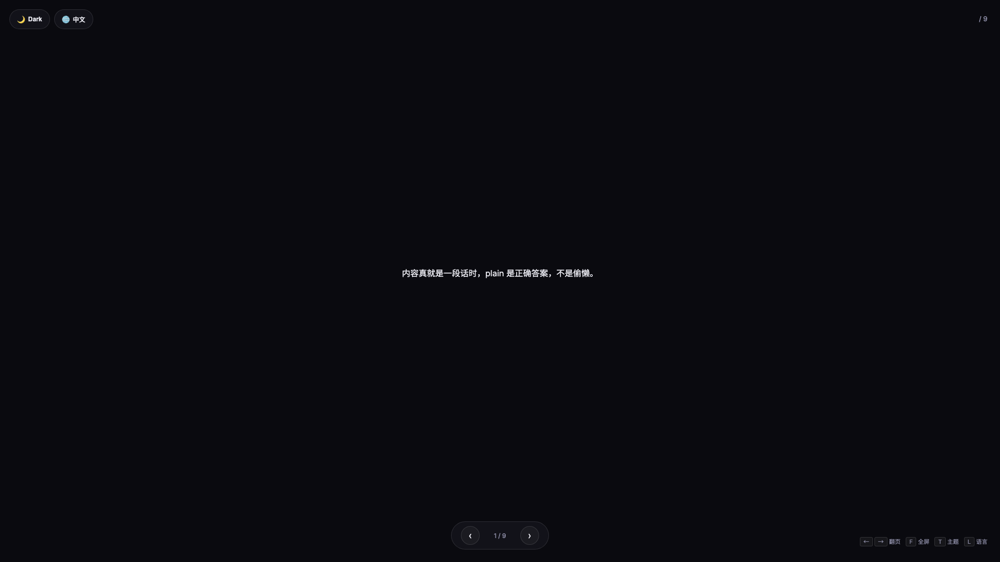
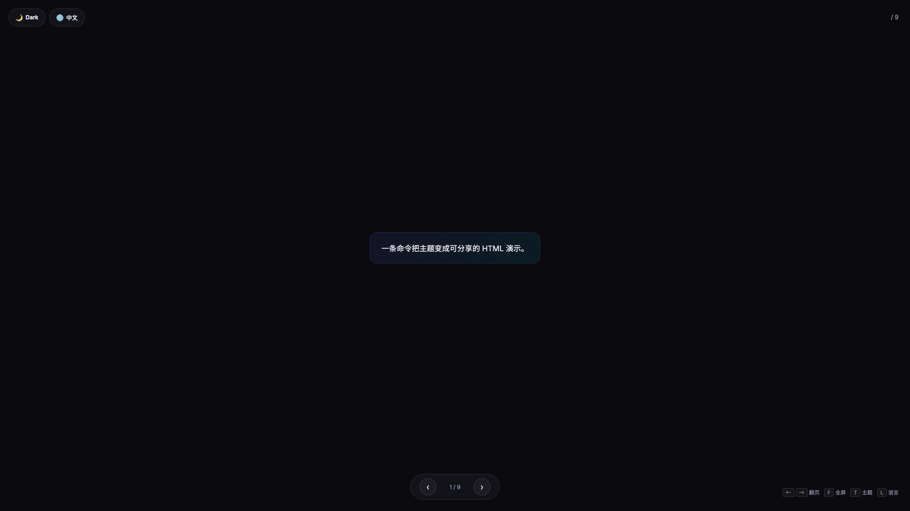
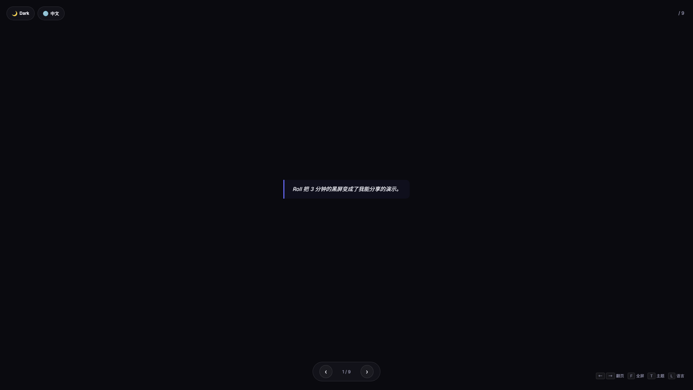
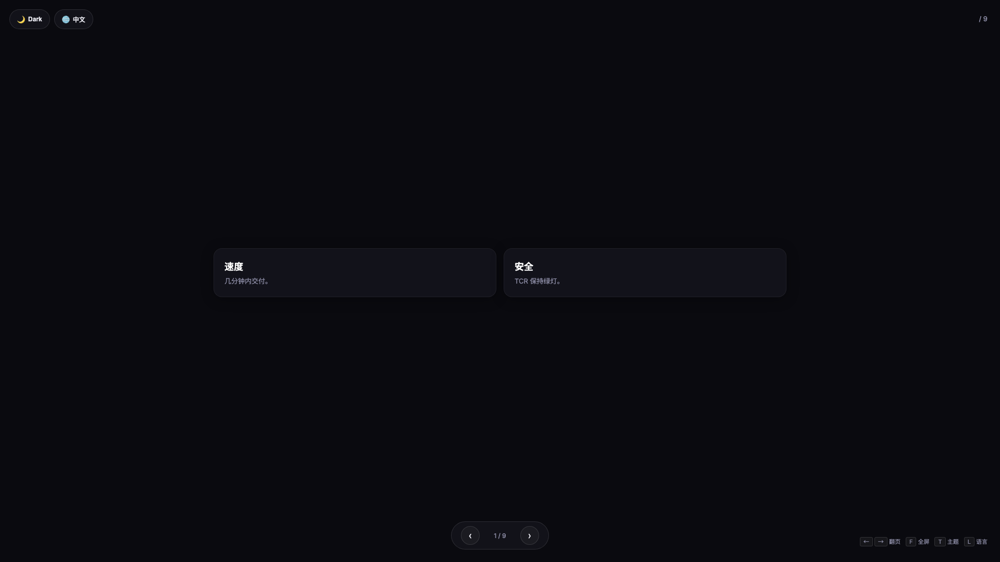
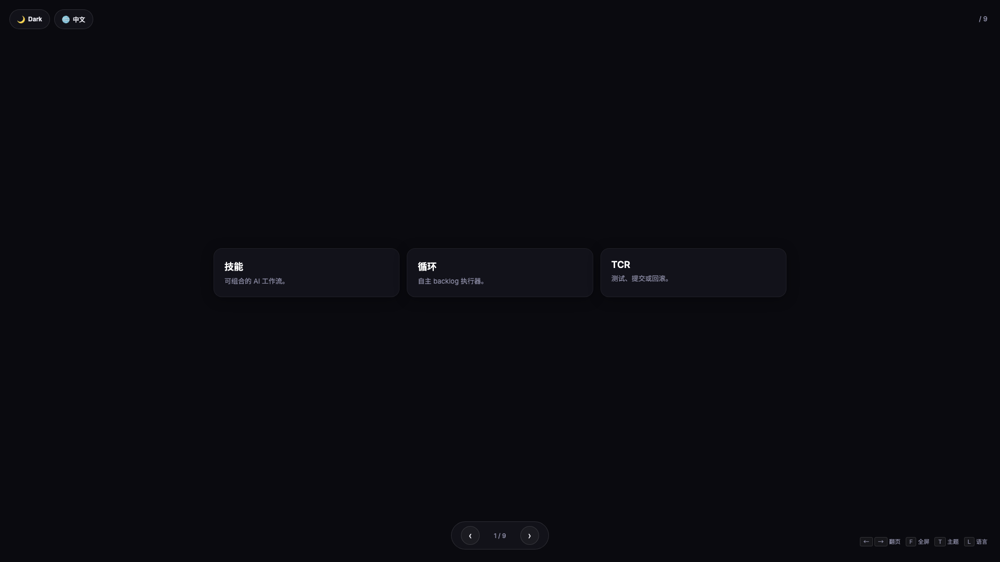
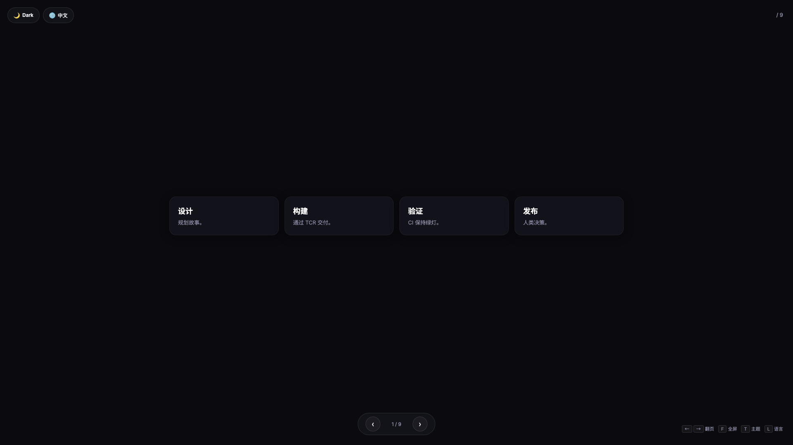
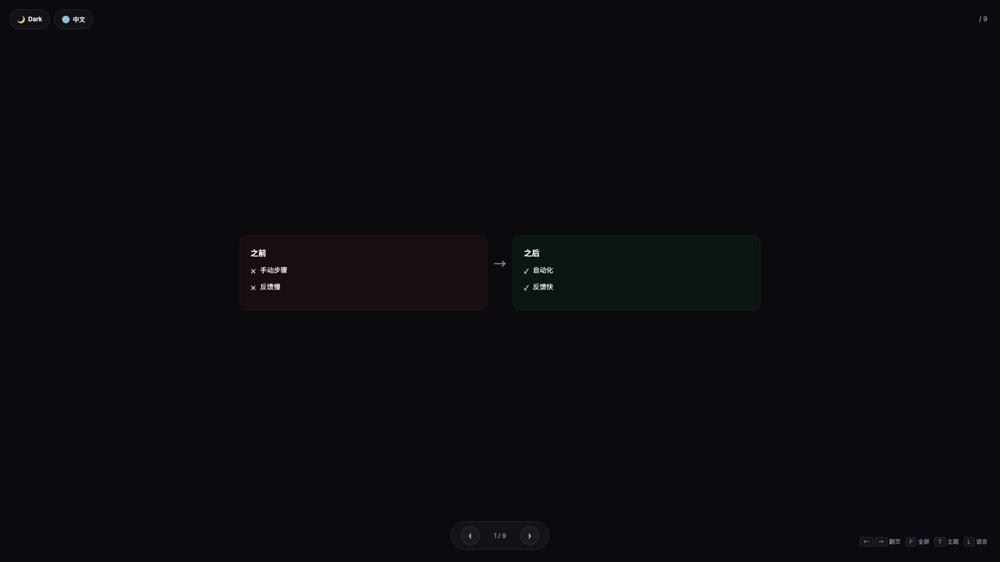
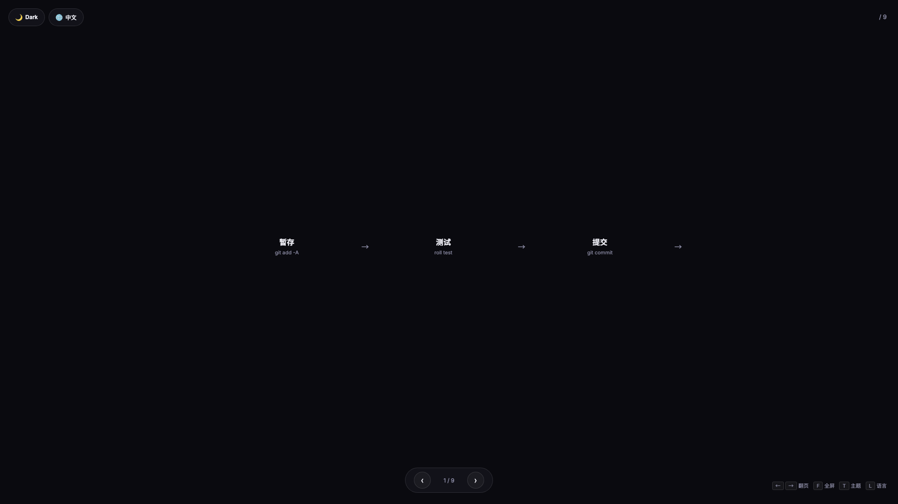
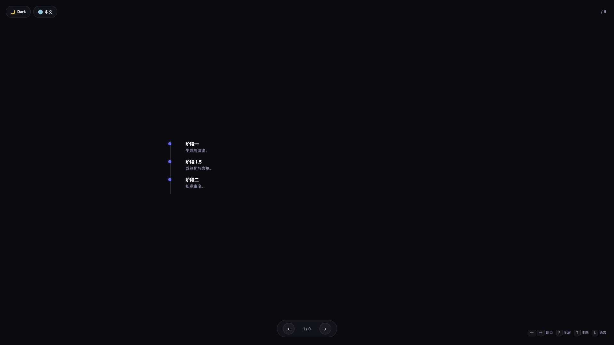

# Roll — 幻灯片

> 把一个主题字符串变成一份可分享的 18 张双语 HTML 幻灯片。
> 流程刻意分两层：AI 写 `deck.md`，确定性的 bash 步骤把它渲染成 HTML。
> 你随时可以手动改 `deck.md` 再重新渲染。

## What & Why（是什么 & 为什么）

`roll slides` 是 Roll 的幻灯片生成器。存在的理由：

- 从零手写 HTML deck 太慢；用临时 prompt 让 AI 直接写 HTML 又难以保持视觉一致、难以复现。
- 一份开源项目的 deck 通常**骨架相同**——封面、问题、方案、演示、证据、号召行动——但**内容**因主题而变。
- 我们希望**内容**来自项目本身的代码、README、backlog，而不是 LLM 当天臆想的东西。

所以管线被拆成：

| 层级 | 工具 | 作用 |
|------|------|------|
| 创作 | `roll slides new` + `roll-deck` skill | 读你的仓库，写一份含 18 张双语 slide 和 evidence 引用的 `deck.md`。 |
| 渲染 | `roll slides build`（Python，无 AI） | 用 schema 校验 `deck.md`，套 Mustache 风格模板，输出自包含 `.html`。 |
| 浏览 | `roll slides list` / `roll slides preview` | 列出已有 deck；用浏览器打开任一份。 |

这层拆分是刻意的。bash 一侧可复现——同样的 `deck.md` 和模板，每次都得到一样的 HTML。AI 一侧接受一定的不确定性，换取速度。

## 快速上手

从主题到浏览器可见 HTML，三步搞定。

### 1. New —— 一条命令直达 HTML

```bash
roll slides new "Introducing Roll Loop"
```

会通过你选定的 agent（如果没选，先 `roll agent use <name>`）加载 `roll-deck` skill。Agent 会：

1. 阅读 `README.md`、`AGENTS.md`、`.roll/backlog.md`、`.roll/features/`。
2. 基于读到的内容打 18 张 slide 的提纲。
3. 只写一个文件：`.roll/slides/<slug>/deck.md`。

`<slug>` 由主题派生（kebab-case，ASCII）。

**默认 `new` 会自动渲染并打开 HTML**——一条命令从主题直达浏览器。Agent 生成完 `deck.md` 后，流水线自动衔接：

```text
✓ generating     (elapsed: 2m 14s)
✓ validating     (elapsed: 0m  1s)
✓ rendering      (elapsed: 0m  2s)
✓ opening        (elapsed: 0m  0s)

Opened in browser: .roll/slides/roll-loop-intro.html
```

用 `--no-build` 停在 `deck.md` 生成后：

```bash
roll slides new "我的草稿" --no-build  # 只生成 deck.md，不渲染
roll slides build my-deck               # 稍后再手动渲染
```

如果主题含糊，skill 允许**一轮**澄清问答再开始写。无法取证的 slide 会被打上 `⚠️ unverified` 标签。

### 2. Review —— 审 `deck.md`

在编辑器里打开 `.roll/slides/<slug>/deck.md`。这是人工质量门。要确认：

- 每张 slide 是否说出了具体的、项目相关的内容？
- 证据引用是不是真实存在的文件路径和行号？
- 被打 `⚠️ unverified` 的 slide，你能不能手动补上？

不满意的地方直接改。这是纯文本文件——标题、正文、证据都可见可编辑。改完跑 `roll slides build <slug>` 重新渲染。

### 3. Share —— 列表、预览、模板管理、删除

```bash
roll slides list             # 列出所有 deck（built / stale / failed / unbuilt 四态）
roll slides preview <slug>   # 用浏览器打开 .roll/slides/<slug>.html
roll slides templates        # 列出可用模板（内置 + 项目自定义）
roll slides delete <slug>    # 删除 deck（目录 + HTML），有确认提示
```

要把 deck 发布到公开站点，参考下面的 [输出位置](#输出位置) 章节——默认 HTML 是 gitignored，只留在本地。

## `deck.md` 格式参考

`deck.md` 有两部分：YAML 风格的 frontmatter，加上每张 slide 的 `## Slide N` 段。

### Frontmatter

必需字段（由 `slides-validate.py` 校验）：

| 字段 | 类型 | 说明 |
|------|------|------|
| `template` | string | 模板名，如 `introduction-v3`。 |
| `slug` | string | kebab-case 标识，要和目录名一致。 |
| `title_en` | string | 英文 deck 标题。 |
| `title_zh` | string | 中文 deck 标题。 |
| `total_slides` | int | 必须等于 `## Slide N` 段的实际数量。 |
| `created` | string | ISO 日期，如 `2026-05-21`。 |

示例：

```markdown
---
template: introduction-v3
slug: roll-loop-intro
title_en: "Introducing Roll Loop"
title_zh: "认识 Roll Loop"
total_slides: 18
created: 2026-05-21
---
```

### Slide 段

每张 slide 由 `## Slide N` 头部加一个 `layout` 声明、该 layout 的内容键和一个 evidence 列表组成：

```markdown
## Slide 1
layout: plain
title_en: "Why autonomy"
title_zh: "为什么要自主"
body_en: |
  Roll Loop reads the backlog on a schedule and ships items via
  the same git + CI flow you already trust.
body_zh: |
  Roll Loop 会按计划读取 backlog，并通过你既有的 git + CI 流程交付。
evidence:
  - README.md:33
  - guide/en/loop.md:12
```

每张 slide 都声明 `layout:`（默认 `plain`），加上 `title_en` / `title_zh`。其余键取决于 layout——`plain` 和 `highlight` 用 `body_en` / `body_zh`；更丰富的 layout 用 `cards`、`left_items`、`stages`、`items` 等结构化字段。完整的逐 layout 字段参考见 [Layouts（布局）](#layouts布局)。

`evidence` 是 `<path>:<line>` 引用列表——每 3 张 slide 至少 1 条（详见 [Grounding](#grounding-与-evidence-约定)）。

### 支持的 Mustache 占位符

`slides-render.py` 仅实现一个小的 Mustache 子集供模板层使用。自定义模板（Phase 2）可用：

| 占位符 | 含义 |
|--------|------|
| `{{var}}` | 从当前上下文取值，HTML 转义后插入。 |
| `{{{var}}}` | 原样替换（不转义）。用于已渲染的 HTML。 |
| `{{#section}} ... {{/section}}` | 列表迭代；若值为真则渲染一次。 |
| `{{^section}} ... {{/section}}` | 反向段——值缺失或为假时渲染。 |

**故意不支持**的：partials（`{{>name}}`）、lambda、自定义定界符（`{{=<% %>=}}`）、点路径查找（`{{a.b}}`）。

渲染上下文暴露 frontmatter 标量（`title_en`、`title_zh`、`total_slides` 等）和 `slides` 列表。每张 slide 项暴露 `number`、`layout`、`title_en`、`title_zh`、`evidence`，以及该 layout 声明的结构化字段（如 `plain` / `highlight` 的 `body_en_html` / `body_zh_html`，或更丰富 layout 的 `cards` / `stages` / `items`——见 [Layouts（布局）](#layouts布局)）。

## Layouts（布局）

每张 slide 都声明一个 `layout`。layout 决定这张 slide **长什么样**——一段普通段落、红绿双栏对比、横向流水线、纵向时间线、并列卡片、引用金句，或单条结论高亮。按**内容形态**选 layout，而不是为了好看硬凑：内容真就是一段话时，`plain` 是正确答案。

`layout` 会按固定白名单校验。自创名字（或缺了该 layout 必需字段）会让 build 失败，并明确告诉你该补什么。不写 `layout` 等同 `plain`——Phase 1 的旧 deck 照常工作。

| Layout | 适用 | 不要用于 |
|--------|------|----------|
| `plain` | 普通段落、解释、纯列表 | 内容其实是对比 / 流程 / 时间线 |
| `cards-2` | 2 个并列概念，左右并排 | 3 个以上（用 `cards-3` / `cards-4`） |
| `cards-3` | 3 大支柱、三选项、三步总结 | 2 项（用 `cards-2`） |
| `cards-4` | 4 象限、价格档位、团队角色 | 不足 4 项（太稀疏） |
| `compare` | 前后对比、旧 vs 新、问题/方案 | 不相关的项（用 `cards`） |
| `pipeline` | 顺序流程、CI/CD、有序步骤 | 无序项（用 `cards`） |
| `timeline` | 时间序列、历史、路线图 | 单个事件（用 `highlight`） |
| `quote` | 引言、金句、用户原话 | 多段落散文（用 `plain`） |
| `highlight` | 关键结论 / 一句话总结 | 普通正文（用 `plain`） |

下面的字段名与 `lib/slides/components/README.md` 以及 `roll-deck` skill 的选择手册逐字一致——原样照抄。

### `plain`

自由段落。键：`body_en`、`body_zh`。

```markdown
## Slide 9
layout: plain
title_en: "Plain Prose"
title_zh: "普通段落"
body_en: |
  When the content is genuinely one block of prose, plain is the
  correct choice — not a failure.
body_zh: |
  内容真就是一段话时，plain 是正确答案，不是偷懒。
evidence:
  - README.md:1
```



### `highlight`

单条结论 / 一句话高亮。键：`body_en`、`body_zh`。

```markdown
## Slide 6
layout: highlight
title_en: "Key Takeaway"
title_zh: "关键结论"
body_en: |
  One command takes a topic to a shareable HTML deck.
body_zh: |
  一条命令把主题变成可分享的 HTML 演示。
evidence:
  - README.md:1
```



### `quote`

带归属的引用金句。键：`text_en`、`text_zh`。

```markdown
## Slide 5
layout: quote
title_en: "What Users Say"
title_zh: "用户原话"
text_en: "Roll turned a 3-minute black screen into a deck I can share."
text_zh: "Roll 把 3 分钟的黑屏变成了我能分享的演示。"
evidence:
  - README.md:1
```



### `cards-2` / `cards-3` / `cards-4`

2 / 3 / 4 个无先后的并列概念。键：`cards`，数组，每项含 `title_en`、`title_zh`、`body_en`、`body_zh`。

```markdown
## Slide 7
layout: cards-3
title_en: "Three Pillars"
title_zh: "三大支柱"
cards:
  - title_en: "Skills"
    title_zh: "技能"
    body_en: "Composable AI workflows."
    body_zh: "可组合的 AI 工作流。"
  - title_en: "Loop"
    title_zh: "循环"
    body_en: "Autonomous backlog executor."
    body_zh: "自主 backlog 执行器。"
  - title_en: "TCR"
    title_zh: "TCR"
    body_en: "Test, commit, or revert."
    body_zh: "测试、提交或回滚。"
evidence:
  - README.md:1
```

`cards-2` 和 `cards-4` 用同样的 `cards` 数组，分别放 2 项或 4 项。







### `compare`

两栏：左（如"之前"）vs 右（如"之后"）。键：`left_title_en` / `left_title_zh` / `right_title_en` / `right_title_zh`，加上 `left_items` 和 `right_items`——数组，每项含 `text_en` / `text_zh`。

```markdown
## Slide 2
layout: compare
title_en: "Before vs After"
title_zh: "前后对比"
left_title_en: "Before"
left_title_zh: "之前"
right_title_en: "After"
right_title_zh: "之后"
left_items:
  - text_en: "Manual steps"
    text_zh: "手动步骤"
right_items:
  - text_en: "Automated"
    text_zh: "自动化"
evidence:
  - README.md:1
```



### `pipeline`

横向、有序的阶段序列。键：`stages`，数组，每项含 `title_en`、`title_zh`、`desc_en`、`desc_zh`，以及可选的 `css_class`（`pipe-idea`、`pipe-backlog`、`pipe-build`、`pipe-verify` 或 `pipe-release`）。

```markdown
## Slide 3
layout: pipeline
title_en: "Build Pipeline"
title_zh: "构建流水线"
stages:
  - title_en: "Stage"
    title_zh: "暂存"
    desc_en: "git add -A"
    desc_zh: "git add -A"
  - title_en: "Test"
    title_zh: "测试"
    desc_en: "roll test"
    desc_zh: "roll test"
evidence:
  - README.md:1
```



### `timeline`

纵向、按时间排序的事件列表。键：`items`，数组，每项含 `title_en`、`title_zh`、`body_en`、`body_zh`。

```markdown
## Slide 4
layout: timeline
title_en: "Project Evolution"
title_zh: "项目演进"
items:
  - title_en: "Phase 1"
    title_zh: "阶段一"
    body_en: "Generate and render."
    body_zh: "生成与渲染。"
  - title_en: "Phase 2"
    title_zh: "阶段二"
    body_en: "Visual richness."
    body_zh: "视觉富度。"
evidence:
  - README.md:1
```



### `$roll-deck` 怎么挑 layout

跑 `roll slides new "<主题>"` 时，`roll-deck` skill 会按**内容形态**逐张挑 layout——前后对比挑 `compare`、多步骤流程挑 `pipeline`、时间序列挑 `timeline`、并列概念挑 `cards-N`、带归属的金句挑 `quote`、一句话结论挑 `highlight`，其余挑 `plain`。同一套决策矩阵写在 `skills/roll-deck/SKILL.md`（"Layout 选择手册"），本文档与该手册保持同步。你随时可以改 `deck.md` 里的 `layout:` 覆盖 AI 的选择，再跑 `roll slides build <slug>` 重渲染。

## Grounding 与 evidence 约定

讲项目的 deck 必须**引用项目本身**。约定：

- **阈值**：整份 deck 的 evidence 总数不少于 `ceil(total_slides / 3)`——即**平均每 3 张 slide 至少 1 条 evidence**。18 张 deck 即 ≥ 6 条。
- **格式**：`<path>:<line>`（如 `packages/cli/src/runner/executor.ts:719`），路径相对仓库根。
- **覆盖**：证据要分散，不要一股脑堆在某一张上。聚集意味着其余 slide 无 grounding。
- **无法取证的论断**：实在没法引用时，在 body 前加 `⚠️ unverified` 和一行原因。校验仍会通过，但读者知道该重点审视哪些 slide。

`roll slides build` 会先跑校验。低于 grounding 阈值时构建中止，输出 `⚠️ grounding below threshold`。修法是补 evidence 或删掉空话 slide——不要绕过校验。

## 输出位置

默认情况下，构建产物**只留在本地**：

```
.roll/slides/<slug>/deck.md        ← 源文件，是否纳入 git 看项目策略（通常也忽略）
.roll/slides/<slug>.html           ← 渲染产物，gitignored
.roll/.gitignore                   ← 自动追加 slides/*.html
```

大部分 Roll 项目里 `.roll/` 本身就在 `.gitignore`。`.roll/.gitignore` 这一行是"双保险"——即便有项目把 `.roll/` 纳入跟踪，渲染出来的 HTML 仍然不会被提交。

### 把 deck 发布到公开站点

要把 deck 放到对外文档站（如 GitHub Pages）：

1. 确定公开路径，如 `site/slides/<slug>.html`。
2. 拷贝渲染产物：

   ```bash
   mkdir -p site/slides
   cp .roll/slides/<slug>.html site/slides/<slug>.html
   ```

3. 强制添加——根 `.gitignore` 可能会匹配——并提交：

   ```bash
   git add -f site/slides/<slug>.html
   git commit -m "Story X: publish <slug> deck"
   ```

4. 可选：在站点首页 / README 里加链接。

把源 `deck.md` 留在 `.roll/slides/<slug>/` 下，方便后续 `roll slides build <slug>` 原地重渲染。**不要**只 commit HTML 然后手改它——改 `deck.md` 再重渲染。

## `list` —— 四态总览

`roll slides list` 把 `.roll/slides/` 下每个 deck 按四种状态展示：

| 图标 | 状态 | 含义 |
|------|------|------|
| `✓` | **built** | `<slug>.html` 存在且最近无失败记录。可以分享。 |
| `≈` | **stale** | `<slug>.html` 存在，但 `deck.md` 在上次构建后被改动过。重新 `build`。 |
| `⚠` | **failed** | 上次 `build` 失败。`.last-build.err` 文件记录了详情。`roll slides logs <slug>` 查看。 |
| `✗` | **unbuilt** | 无 HTML、无错误文件。`deck.md` 存在但尚未构建。 |

## 失败恢复

`build` 出错时，错误信息按失败类型给出对应的恢复路径，不需要翻源码或搜 issue。

### 模板未找到

```text
[FAIL] Template "custom-dark" not found

Available templates (built-in):
  introduction-v3    lib/slides/templates/introduction-v3.html

See also: roll slides templates
```

修复：检查 `deck.md` frontmatter 中的模板名是否与可用模板匹配。跑 `roll slides templates` 看所有选项，包括你已安装的项目级覆盖。

### 校验失败

```text
[FAIL] Validation failed
  deck.md:42 — required field "title_zh" missing
  deck.md:67 — frontmatter: total_slides=18 but found 19 ## Slide blocks
```

修复：错误直接指向行号。打开 `deck.md` 到指定行，改好后重跑 `roll slides build <slug>`。

### 渲染器崩溃

```text
[FAIL] Renderer crashed

See: roll slides logs <slug>
Last 5 lines of traceback:
  File ".../slides-render.py", line 312, in _render_slide
    raise ValueError(f"Unknown layout: {layout}")
```

修复：跑 `roll slides logs <slug>` 看完整错误日志，然后修 `deck.md` 或把日志附在 issue 里。

## 自定义模板

不用 fork 或修改 Roll 安装本身，就能按项目覆盖内置的幻灯片模板。

### 原理

在 `.roll/slides/templates/` 下放一个**和内置模板同名**的 `.html` 文件。`build` 解析模板时的查找顺序：

1. `.roll/slides/templates/<name>.html` —— 你的项目覆盖
2. `${ROLL_PKG_DIR}/lib/slides/templates/<name>.html` —— Roll 内置
3. 都没找到 → 模板未找到错误（见 [失败恢复](#失败恢复)）

### 示例

```bash
# 拷贝内置模板作为起点
mkdir -p .roll/slides/templates
cp "$(roll slides templates | grep introduction-v3 | awk '{print $NF}')" \
   .roll/slides/templates/introduction-v3.html

# 编辑颜色、字体、布局——Mustache 占位符不变
# 下一次 build 会自动用你的版本
roll slides build my-deck
```

### 占位符契约

你的自定义模板必须支持与内置模板相同的 Mustache 占位符。最小集合：

| 占位符 | 含义 |
|--------|------|
| `{{title_en}}` / `{{title_zh}}` | Deck 级标题 |
| `{{#slides}} ... {{/slides}}` | slide 迭代块 |
| `{{number}}` | 迭代中的 slide 编号 |
| `{{title_en}}` / `{{title_zh}}` | 迭代中的 slide 级标题 |
| `{{{body_en_html}}}` / `{{{body_zh_html}}}` | 已渲染的 slide 正文 |

完整参考见 [支持的 Mustache 占位符](#支持的-mustache-占位符) 章节。

跑 `roll slides templates` 查看当前可用模板及来源（内置 vs 项目覆盖）。

## 新命令（Phase 1.5）

### `roll slides logs <slug>`

打印 deck 的上次构建失败日志：

```bash
roll slides logs my-deck
# → 显示 .roll/slides/my-deck/.last-build.err 的内容
# → 若从未失败，提示 "No failure log for this deck"
```

### `roll slides templates`

列出每份可用模板、来源和路径：

```bash
roll slides templates
# TEMPLATE             SOURCE    PATH
# introduction-v3      builtin   /opt/roll/lib/slides/templates/introduction-v3.html
# pitch                builtin   /opt/roll/lib/slides/templates/pitch.html
# introduction-v3      project   .roll/slides/templates/introduction-v3.html
```

### `roll slides delete <slug>`

删除 deck 的目录和 HTML 文件：

```bash
roll slides delete my-deck          # 确认提示（y/N）
roll slides delete my-deck --force  # 跳过确认（CI/脚本用）
```

## 常见陷阱

### AI 内容浅尝辄止

症状：deck 读起来像通用介绍，bullet 是"Roll is fast"这种，没有项目特有的例子。

纠偏：

- **直接改 `deck.md`**。纯文本文件，重写某张 slide 的 `body_en` / `body_zh` 让它具体起来。再跑 `roll slides build <slug>` 重渲染。
- **先加 evidence 再写正文**。一旦被迫引用真实文件和行号，slide 内容自然就具体了。
- **用更尖锐的主题重新生成**。`roll slides new "How TCR keeps Roll's loop honest"` 会比 `roll slides new "Roll"` 好很多。

### 校验失败：`total_slides mismatch`

症状：frontmatter 写 `total_slides: 18`，但 `## Slide N` 段只有 17 个（或反之）。

纠偏：数一下 `## Slide` 头并改 frontmatter。`grep -c '^## Slide ' .roll/slides/<slug>/deck.md` 可以确认数量。

### 校验失败：`missing required frontmatter field`

症状：校验器点名某个字段，如 `created` 或 `slug`。

纠偏：打开 `deck.md`，加上合适的值保存，重跑 `roll slides build`。六个必需字段见上面的 [Frontmatter](#frontmatter)。

### 校验失败：grounding 阈值不足

症状：`⚠️ grounding below threshold: 3 evidence citation(s) for 18 slides (need >= 6)`。

纠偏：给引用不足的 slide 加 `evidence:` 行。目标是每 3 张连续 slide 至少 1 条引用。若某条论断实在无法引用，把那张 slide 打成 `⚠️ unverified` 并降低 deck 整体的论断密度。

### `roll slides build` 浏览器没打开 / 打开错的

症状：构建成功，但浏览器没起来（或打开了奇怪的东西）。

纠偏：传 `--no-open` 抑制自动打开，再用 `roll slides preview <slug>` 显式打开。Linux 用 `xdg-open`，macOS 用 `open`。在 shell rc 里设 `ROLL_SLIDES_NO_OPEN=1` 可以全局禁用自动打开。

### 重新 `roll slides new` 会覆盖现有 deck

症状：再来一次 `roll slides new "<同样的主题>"`，要覆盖你已经手动改过的 `deck.md`。

纠偏：skill 被要求**在覆盖前征求同意**。若你点了同意，原编辑就丢了。要么先改名（`mv .roll/slides/<slug> .roll/slides/<slug>-v2`），要么直接编辑现有 `deck.md` 而不要重新生成。

## 相关链接

- [overview.md](overview.md) —— Roll 是什么、三层模型。
- [skills.md](skills.md) —— 按任务选择合适的 skill。
- `skills/roll-deck/SKILL.md` —— 创作层 skill 的硬约束。
- `lib/slides-render.py` —— Mustache 子集 + markdown 子集参考。
- `lib/slides-validate.py` —— schema 与 grounding 规则。
